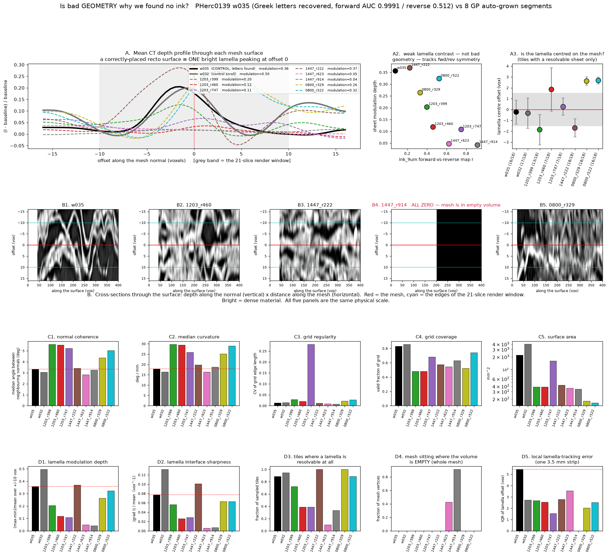

# Investigation A — Is bad geometry (not absent ink) why the GP screen found nothing?

_Measured 2026-08-17. All numbers below come from the released S3 data (anonymous), recomputed
locally; nothing is quoted from a previous run._

## Verdict

**No. Surface geometry is not why we found nothing.**

On every mesh-shape statistic (grid regularity, normal coherence, curvature, holes, tears,
self-contact) the Grand-Prize auto-grown meshes are *comparable to or better than* w035 — the
PHerc0139 segment where `ink_9um` reproduces human-verified Greek letters at pixel AUC 0.9991
(forward) / 0.512 (reverse). And on the measurement that actually matters — where the papyrus
lamella sits relative to the mesh along its own normal — the GP meshes are **not** systematically
displaced. The control itself sits 0.23 voxels off its lamella centre with an interquartile spread
of 2.2 voxels, and its lamella wanders ±5 voxels relative to the mesh over a 3.4 mm strip: the
worst local tracking in the whole set. The letter-reading instrument therefore tolerates several
voxels of surface misplacement, and the GP meshes are inside that tolerance.

Two real defects *were* found, but neither is "the mesh is a few voxels off the recto":

1. **PHerc1447 publishes segments that are largely in empty volume.** 91.1 % of the vertices of
   `auto_grown_20250502160708188` and 42.7 % of `auto_grown_20250502161324419` land on voxels whose
   value is exactly 0 — outside the scanned/masked material. The ink screen of those segments was
   measuring nothing. This is not isolated: **18 of the 66 unique meshes in the whole screened
   corpus — every one of them PHerc1447 — put part of their surface outside the reconstructed volume
   array entirely** (up to 21.2 %), and direct level-3 sampling of nine PHerc1447 segments finds
   seven with 27 %–96 % of their vertices on zero-valued voxels. PHerc1203 and PHerc0800: zero
   affected segments, on every check.
2. **The GP scrolls we screened have 2–10× lower lamella contrast than PHerc0139 at 9 µm.** That is
   a property of the scan and the compaction of the roll, not of the mesh — no re-meshing creates an
   interface that was not resolved at acquisition. It is the strongest surviving candidate
   explanation for the null (see §6 for why it cannot be cleanly separated from defect 1 on this
   sample).

The one segment that matches the control on every statistic that separates the control from the
rest — PHerc1447 `auto_grown_20250702235910292` (lamella modulation 0.370 vs the control's 0.357,
interface sharpness 0.101 vs 0.078, 18/18 tiles with a resolvable lamella, 0 % empty volume) —
produced the lowest forward-vs-reverse correlation in the entire 80-segment corpus (r = 0.222,
control 0.076) and still no letters and no tripwire hit. For that segment, geometry is definitively
not the blocker.

This is not only an inference from the control's own sloppiness. The parallel Investigation B
(`hunt/depth_offset_plan.md`) measured the tolerance curve directly with the real checkpoint by
sliding `ink_9um`'s 17-slice window along the normal on w035: **97.6 % of excess-over-chance
survives a ±3-voxel displacement and ~80 % survives ±5**. Every displacement measured here is
inside that flat top.

**Actionable consequence: do not spend the remaining budget fixing GP geometry.** The corpus-selection
gap identified earlier stands unchanged — we screened PHerc1203 (index SNR 87), PHerc1447 (8.5, the
worst of 14) and PHerc0800 (20), while PHerc0813 (159.6), 0125 (114.2), 1545 (112.2), 0211 (106.6),
0191 (99.6) and 0358 (91.8) have no published mesh at all. Getting surfaces onto the good scrolls is
worth far more than re-rendering the ones we have.

---

## 1. What was measured, and on what

Ten `tifxyz` meshes, all fetched anonymously from `s3://vesuvius-challenge-open-data`:

| Key | Segment | Volume |
|---|---|---|
| **w035** (control) | `PHerc0139/segments/20260317000000-w035_2026031718/mesh/20260317000000-on-20250728140407-9.362um.tifxyz` | `PHerc0139/volumes/20250728140407-9.362um-1.2m-113keV-masked.zarr` |
| w032 (2nd control) | `PHerc0139/segments/20260203000000-w032_2026020303/mesh/20260203000000-on-20250728140407-9.362um.tifxyz` | same |
| 1203_r399 | `PHerc1203/segments/raw/auto_grown_20250923164713356/` | `PHerc1203/volumes/20250820131727-9.362um-…` |
| 1203_r460 | `PHerc1203/segments/raw/auto_grown_20250923163217042/` | same |
| 1203_r747 | `PHerc1203/segments/raw/auto_grown_20251005230830031/` | same |
| 1447_r222 | `PHerc1447/segments/raw/auto_grown_20250702235910292/` | `PHerc1447/volumes/20250521151220-8.640um-…` |
| 1447_r623 | `PHerc1447/segments/raw/auto_grown_20250502161324419/` | same |
| 1447_r914 | `PHerc1447/segments/raw/auto_grown_20250502160708188/` | same |
| 0800_r329 | `PHerc0800/segments/20251028213516-…/mesh/intermediate/tifxyz_original/` | `PHerc0800/volumes/20250521135224-8.640um-…` |
| 0800_r522 | `PHerc0800/segments/20251028220955-…/mesh/intermediate/tifxyz_original/` | same |

The eight GP segments were chosen to span the full range of the forward-vs-reverse prediction
correlation measured in the 80-segment screen (`out/survey/survey_all.json`): lowest, middle and
highest per scroll. The suffix in each key is that `fwd_rev_r`.

**Geometry statistics** (`geom_stats.py`) are computed on the whole stored grid, no volume access.
**Depth profiles** (`depth_profile.py`) sample the level-0 CT volume along the mesh normal at
offsets −16 … +16 voxels in 0.5-voxel steps by trilinear interpolation, at 18 tiles of 112 × 112
full-resolution grid points per mesh (≈ 12 600–13 700 sampled points per mesh), using exactly the
same coordinate convention and interpolation as `runpod/render_tifxyz_sv.py`. Both the per-point
profile and the tile-mean profile are analysed: the per-point profile is dominated by fibre texture,
the tile-mean profile is what the 21-slice render effectively presents to the ink model.
**Cross-sections** (`crosssection.py`) cut a depth × arc-length image through one 3.4–3.7 mm strip
of each mesh. **Whole-mesh material occupancy** (`check_air.py`) reads the mesh bounding box once at
pyramid level 3 (8× down, ≈ 70–75 µm voxels — far too coarse to see a lamella, but decisive for "is
there any scanned material here") and samples every valid vertex.



_Figure: `out/geometry_compare.png` (source `make_figures.py`). Panel A: mean depth profile through
each mesh. A2: lamella contrast against the fwd/rev symmetry symptom. A3: lamella-centre offset,
measured only on tiles where a lamella is resolvable. B: depth × arc-length cross-sections.
C: mesh-shape statistics. D: sheet-placement and sheet-contrast statistics. Larger single-mesh
cross-sections: `out/cs_detail.png`._

---

## 2. Master table

| Statistic | **w035** (CONTROL) | w032 (ctrl scroll) | 1203_r399 | 1203_r460 | 1203_r747 | 1447_r222 | 1447_r623 | 1447_r914 | 0800_r329 | 0800_r522 |
|---|---|---|---|---|---|---|---|---|---|---|
| **Scroll** | PHerc0139 | PHerc0139 | PHerc1203 | PHerc1203 | PHerc1203 | PHerc1447 | PHerc1447 | PHerc1447 | PHerc0800 | PHerc0800 |
| **Provenance** | seeded from curated wrap, grown on **2 µm surface-prediction volume** | seeded from curated wrap, grown on **2 µm surface-prediction volume** | auto-grown in the **native 9 µm-class scroll volume** | auto-grown in the **native 9 µm-class scroll volume** | auto-grown in the **native 9 µm-class scroll volume** | auto-grown in the **native 9 µm-class scroll volume** | auto-grown in the **native 9 µm-class scroll volume** | auto-grown in the **native 9 µm-class scroll volume** | auto-grown in the **native 9 µm-class scroll volume** | auto-grown in the **native 9 µm-class scroll volume** |
| **Growth generations** | 2 | 1 | 75 | 75 | 198 | 200 | 200 | 200 | 86 | 44 |
| **ink_9um fwd-vs-rev map r** | 0.076 | — | 0.399 | 0.460 | 0.747 | 0.222 | 0.623 | 0.914 | 0.329 | 0.522 |
| **— GRID / SHAPE —** |  |  |  |  |  |  |  |  |  |  |
| **Area (mm²)** | 2198 | 4013 | 389 | 389 | 1610 | 426 | 361 | 345 | 181 | 163 |
| **Grid coverage (valid frac)** | 0.833 | 0.858 | 0.480 | 0.480 | 0.680 | 0.576 | 0.547 | 0.630 | 0.526 | 0.741 |
| **Interior holes** | 0 | 0 | 0 | 0 | 0 | 14 | 14 | 9 | 0 | 0 |
| **Grid edge-length CV** | 0.0136 | 0.0151 | 0.0281 | 0.0201 | 0.2808 | 0.0114 | 0.0091 | 0.0074 | 0.0213 | 0.0269 |
| **Edges > 2× median (tears)** | 0.00000 | 0.00000 | 0.00000 | 0.00000 | 0.03064 | 0.00000 | 0.00000 | 0.00000 | 0.00000 | 0.00000 |
| **— CURVATURE / NORMALS —** |  |  |  |  |  |  |  |  |  |  |
| **Normal dispersion, median (°)** | 3.33 | 3.06 | 5.59 | 5.53 | 5.23 | 3.42 | 2.83 | 3.25 | 4.36 | 5.02 |
| **Normal dispersion, p99 (°)** | 16.6 | 17.9 | 34.2 | 27.2 | 163.5 | 15.6 | 12.0 | 13.5 | 14.3 | 16.2 |
| **Frac normals >30° apart** | 0.00052 | 0.00070 | 0.01553 | 0.00765 | 0.06021 | 0.00032 | 0.00009 | 0.00000 | 0.00000 | 0.00000 |
| **Frac antiparallel neighbours** | 0.00000 | 0.00004 | 0.00028 | 0.00000 | 0.02788 | 0.00000 | 0.00000 | 0.00000 | 0.00000 | 0.00000 |
| **Curvature, median (°/mm)** | 17.8 | 16.4 | 29.7 | 29.5 | 25.9 | 19.8 | 16.4 | 18.8 | 25.1 | 29.0 |
| **Radius of curvature (mm)** | 3.22 | 3.50 | 1.93 | 1.94 | 2.21 | 2.90 | 3.50 | 3.05 | 2.28 | 1.97 |
| **— IS THE MESH ON A SHEET? —** |  |  |  |  |  |  |  |  |  |  |
| **Frac mesh w/ no scanned material** | 0.000 | 0.000 | 0.000 | 0.000 | 0.000 | 0.000 | 0.427 | 0.911 | 0.000 | 0.000 |
| **Sheet-centre offset, median (vox)** † | 0.32 | -0.20 | -1.80 | -0.14 | 0.68 | -1.70 | -1.49 | -1.81 | 2.62 | 2.55 |
| **Sheet-centre offset IQR (vox)** † | 2.24 | 2.67 | 2.12 | 4.22 | 1.45 | 1.67 | 3.06 | 2.42 | 0.78 | 0.58 |
| **Per-point centroid within 2 vox** | 0.674 | 0.657 | 0.694 | 0.732 | 0.720 | 0.688 | 0.610 | 0.582 | 0.613 | 0.653 |
| **— SHEET CONTRAST —** |  |  |  |  |  |  |  |  |  |  |
| **Sheet modulation (max−min)/mean** | 0.357 | 0.495 | 0.204 | 0.119 | 0.108 | 0.370 | 0.048 | 0.043 | 0.265 | 0.324 |
| **Peak / gap intensity ratio** | 1.431 | 1.662 | 1.230 | 1.126 | 1.114 | 1.440 | 1.049 | 1.044 | 1.309 | 1.393 |
| **Interface sharpness grad/mean (vox^-1)** | 0.0776 | 0.1316 | 0.0567 | 0.0259 | 0.0287 | 0.1011 | 0.0062 | 0.0070 | 0.0626 | 0.0626 |
| **Per-point contrast (max−min)/255** | 0.374 | 0.363 | 0.255 | 0.240 | 0.252 | 0.298 | 0.183 | 0.178 | 0.257 | 0.279 |
| **Mean DN at offset 0** | 93 | 96 | 119 | 123 | 125 | 113 | 107 | 100 | 108 | 111 |
| **Sheet FWHM (µm)** | 66 | 61 | 80 | 80 | 80 | 82 | 86 | 91 | 69 | 78 |
| **Lamella period (µm)** | 152 | 133 | 138 | 164 | 126 | 151 | 216 | — | 168 | 186 |
| **Tiles with ≥2 sheets in window** | 0.39 | 0.28 | 0.33 | 0.50 | 0.56 | 0.33 | 0.20 | 0.33 | 0.50 | 0.11 |


† computed over **all** sampled tiles, so it is diluted toward 0 for low-contrast meshes; §5
gives the same quantity restricted to tiles where a lamella is actually resolvable, which is the
number to read.

---

## 3. Finding 1 — the controls and the GP meshes were not made the same way

This is not visible in the mesh geometry but it explains the rest, and it is recorded in the
segments' own metadata (`provenance.py`, `out/provenance.json`):

| | w035 / w032 (PHerc0139) | all 8 GP segments |
|---|---|---|
| `volume` the surface was traced in | **`2um_srf_ds2`** — a 2 µm surface-prediction volume, ×2 downsampled | the native 8.6/9.4 µm scroll volume |
| `seed_surface_id` | `w035_2026031718` / `w019_20260203030108447` (a curated wrap) | absent |
| growth generations (`max_gen`) | **2** and **1** | 44, 75, 75, 86, 198, 200, 200, 200 |
| tracker wall time | 1.9 s / 1.1 s | 1.1 s – 702 s |

The controls are essentially *transcriptions* of a human-curated wrap surface that was traced in the
high-resolution scan and written out into 9.362 µm coordinates. The GP meshes are 44–200 generations
of `vc_grow_seg_from_seed` run in the low-resolution volume with no seed surface.

PHerc1447's three meshes even carry the tracker's own confidence signal in `gen_max_cost` (199
generations recorded each). Per-generation max cost starts at 6.5 × 10⁻¹⁶ – 1.3 × 10⁻³ and ends at
0.042–0.117 (peak 0.066–0.187) — a 55×–55 000× blow-up — first crossing 10× its early value at
generation **10, 22 and 24 of 200**. The tracker's own log therefore says that roughly 90 % of each
of those surfaces was grown at a cost one to four orders of magnitude above its confident core.

**This is a genuine provenance gap, and it is the right thing to fix — but it is not what limited
the ink screen.** The measurements below show the resulting meshes are nonetheless well-formed and
well-placed.

---

## 4. Finding 2 — mesh shape is comparable; the GP meshes are not crumpled

Every mesh in the set, control and GP alike, is a quad grid at `scale = 0.05` (one stored cell per
20 voxels, i.e. 173–187 µm) forming a single connected component. With one exception (`1203_r747`,
below) all are clean:

- **Grid regularity.** Edge-length CV: control 0.0136 / 0.0151; GP 0.0074–0.0281 — the three
  PHerc1447 meshes (0.0074–0.0114) are *more* regular than the control. No mesh except
  `1203_r747` has any edge longer than 2× the median.
- **Normal coherence.** Median angle between neighbouring normals: control 3.33° / 3.06°;
  `1447_r623` 2.83°, `1447_r914` 3.25°, `1447_r222` 3.42° — i.e. at or below the control.
  PHerc1203 (5.23–5.59°) and PHerc0800 (4.36–5.02°) are ~1.6× rougher, but the p99 tail is
  comparable (13.5–34.2° vs the control's 16.6–17.9°).
- **Curvature.** Median 16.4–29.7 °/mm across the whole set (control 17.8 / 16.4), i.e. radii of
  1.9–3.5 mm. GP meshes sit on tighter wraps, as expected for segments taken from the middle of a
  roll, but nothing is pathological.
- **Holes and self-contact.** Zero interior holes on the controls and on PHerc1203/PHerc0800;
  PHerc1447 has 9–14 small interior holes (0.4–2.5 % of area). Self-contact (non-adjacent grid
  points within 3 voxels of one another) is 0 everywhere except `1203_r747` (2.5 × 10⁻⁴).

**One exception.** `1203_r747` (`auto_grown_20251005230830031`, 198 generations) *is* structurally
broken: edge-length CV 0.281, 3.1 % of row edges longer than 2× median, 2.8 % of neighbouring
normals antiparallel, p99 normal dispersion 163°. This is a folded/self-overlapping mesh and its
screen result should be discarded. It is 1 of the 8 sampled.

---

## 5. Finding 3 — the meshes sit on the sheet about as well as the control does

This is the measurement the investigation was built for. Two caveats first, because they change how
the numbers must be read:

- The intensity-weighted centroid of the depth profile regresses toward 0 when the profile is flat,
  so a low-contrast mesh will look "perfectly centred" for the wrong reason. All placement numbers
  below are therefore computed **only on tiles where a lamella is actually resolvable**
  (tile-mean modulation ≥ 0.15); the count of such tiles is reported alongside.
- Per-point profiles are dominated by fibre texture at 9 µm. Tile-mean profiles (≈ 780 points,
  ≈ 1 mm² of surface) are the right scale.

| Mesh | tiles with a resolvable lamella | lamella centre offset, median (vox) | IQR (vox) | offset in µm |
|---|---|---|---|---|
| **w035 (control)** | 16 / 18 | **−0.23** | 2.21 | −2 |
| w032 (control) | 17 / 18 | −0.34 | 2.82 | −3 |
| 1447_r222 | **18 / 18** | −1.70 | 1.66 | −15 |
| 1203_r399 | 13 / 18 | −1.86 | 2.79 | −17 |
| 1203_r460 | 7 / 18 | +1.85 | 4.01 | +17 |
| 1203_r747 | 7 / 18 | +0.26 | 1.59 | +2 |
| 0800_r329 | 18 / 18 | **+2.62** | 0.78 | +23 |
| 0800_r522 | 16 / 18 | **+2.68** | 0.61 | +23 |
| 1447_r623 | 1 / 10 | — | — | — |
| 1447_r914 | 1 / 3 | — | — | — |

No GP mesh is displaced by more than 2.7 voxels (23 µm) from the lamella centre, against a render
window of ±10 voxels. The control's own offset is −0.23 voxels with a 2.2-voxel spread, i.e. the
control is *not* pinned to the lamella either.

**One real, correctable defect: PHerc0800.** Both PHerc0800 meshes carry a systematic +2.6-voxel
offset with an unusually tight spread (IQR 0.6–0.8 voxels, versus 1.6–4.0 elsewhere). That is a
consistent bias in the surface, not noise, worth about 1/3 of the measured lamella FWHM (69–78 µm).
It would not blank a 21-slice render, but it does mean the ink-bearing face is off-centre in every
tile of both segments.

**Local tracking.** Two independent measurements of how far the lamella wanders from the mesh
*within* a small patch of surface, in voxels (IQR):

| measurement | w035 | w032 | 1203_r399 | 1203_r460 | 1203_r747 | 1447_r222 | 1447_r623 | 1447_r914 | 0800_r329 | 0800_r522 |
|---|---|---|---|---|---|---|---|---|---|---|
| single 3.4–3.7 mm strip (`out/strip_tracking.json`) | **5.43** | 2.74 | 2.69 | 2.53 | 1.54 | 2.78 | 3.56 | — | 2.03 | 2.53 |
| median over ~1 mm² tiles with a resolvable lamella (`local_tracking_iqr_vox`) | 2.74 | 2.20 | 2.45 | 2.18 | 2.65 | 2.09 | 2.64 | 3.75 | 2.17 | 2.03 |

The control has the **largest** local wander of the whole set on the strip measurement — visible
directly in panel B1 of the figure, where the bright lamella crosses the red mesh line repeatedly
over 3.4 mm. On the tile measurement it is second-highest of the ten (2.74; only `1447_r914`, a
mesh with a single usable tile, is above it). Either way, no GP mesh tracks its lamella materially
worse than the control does. This is the
single most important number in the investigation: the segment that yields AUC 0.9991 has a surface
that wanders ±5 voxels relative to its own papyrus layer. **Sub-voxel surface placement is not a
precondition for reading letters with `ink_9um`, so imprecise placement cannot be the explanation
for a null on meshes that track better than the control does.**

The parallel Investigation B (`hunt/depth_offset_plan.md`) closes this argument with a direct
measurement rather than an inference. Sliding the model's own 17-slice window along the normal on
w035, with the real checkpoint, costs **2.4 % of excess-over-chance at ±3 voxels** (AUC 0.9656 →
0.9546) and **~20 % at ±5** (AUC 0.871); the half-power point extrapolates to |offset| ≈ 9–11
voxels, i.e. only once the ink plane leaves the window entirely. Every displacement measured in
this investigation — including PHerc0800's systematic +2.6 voxels — sits inside the flat top of
that curve. Investigation B also shows that sliding the window on real ink never reproduces the
corpus symptom: fwd/rev r stays in 0.035–0.118 across the whole ±6 sweep, against a corpus
*minimum* of 0.222.

**Window straddling.** The measured lamella period (autocorrelation of tile-mean profiles) is
126–186 µm across the whole set including the control — 13.5–21.5 voxels. The 21-slice window
(±10 voxels ≈ 173–187 µm) therefore spans roughly one lamella period *everywhere*, control included.
The fraction of tiles with ≥ 2 lamellae inside the window is 0.28–0.39 for the controls and
0.11–0.56 for the GP meshes: overlapping ranges. Straddling is not a distinguishing factor.

---

## 6. Finding 4 — what *is* different: lamella contrast

| | modulation depth `(max−min)/mean` over ±10 vox | interface sharpness `\|∇I\|/mean` (vox⁻¹) | peak/gap intensity ratio | mean DN at offset 0 |
|---|---|---|---|---|
| **w035 (control)** | **0.357** | **0.0776** | 1.431 | 93 |
| w032 (control) | 0.495 | 0.1316 | 1.662 | 96 |
| 1447_r222 | **0.370** | **0.1011** | 1.440 | 113 |
| 0800_r522 | 0.324 | 0.0626 | 1.393 | 111 |
| 0800_r329 | 0.265 | 0.0626 | 1.309 | 108 |
| 1203_r399 | 0.204 | 0.0567 | 1.230 | 119 |
| 1203_r460 | 0.119 | 0.0259 | 1.126 | 123 |
| 1203_r747 | 0.108 | 0.0287 | 1.114 | 125 |
| 1447_r623 | 0.048 | 0.0062 | 1.049 | 107 |
| 1447_r914 | 0.043 | 0.0070 | 1.044 | 100 |

**One caveat on `1447_r222` before reading further.** Its lamella contrast is control-grade, but
"lamella contrast" is a *low-frequency* statistic — the modulation over a ~17-voxel period. PHerc1447
is the worst volume of 14 on the mid-band structural-SNR index (8.5 at q = 0.25 cyc/px against
PHerc0139's 115.5), which is a *stroke-scale* statistic. Those are not in conflict: a scan can
resolve gross layering while having no bandwidth left at the scale of a letter stroke. So
`1447_r222` establishes that its mesh sits on well-defined sheets — it does not establish that its
scan could show ink if ink were there.

Read the "mean DN at offset 0" column together with the peak/gap ratio. In PHerc0139 the mesh sits
at 93–96 DN and the lamella peaks 43–66 % above the inter-layer gap. In PHerc1203 the whole profile
sits at 119–125 DN and the lamella peaks only 11–23 % above the gap: **the layers are in contact and
there is no dark inter-lamellar gap to define where one sheet ends and the next begins.** That is a
property of the roll and its scan, not of the mesh — no amount of re-meshing creates an interface
that was not resolved at acquisition.

This ordering also bears on the symptom that motivated the investigation. Forward-vs-reverse
prediction correlation is 0.076 on the control (ink is on one face; reverse-direction AUC collapses
to 0.512, chance) and 0.22–0.91 on the GP corpus. Plotted against modulation depth (figure panel A2)
the relationship is close to monotonic — `1447_r222` (modulation 0.370) has r = 0.222, `1447_r914`
(modulation 0.043) has r = 0.914; Spearman ρ = −0.833 over these 8 meshes.

**But on this sample the two candidate explanations are collinear and I cannot separate them.**
Low modulation and high emptiness co-occur in exactly the meshes that drive the trend
(`1447_r623`, `1447_r914`). The parallel Investigation B (`hunt/depth_offset_plan.md`) settles this
on the full corpus: over all 80 survey rows, ρ(r, rendered non-zero fraction) = −0.650, and within
PHerc1447 alone −0.747; splitting at non-zero fraction 0.55 gives median r = 0.763 for sparse
canvases against 0.502 for well-filled ones, with r essentially uncorrelated with fill inside the
well-filled subset. So the honest reading is: **`fwd_rev_r` is a signal-dominance meter with two
independent drivers — an empty canvas (§7) and a mesh that is not on a coherent lamella (§6) — and
neither of them is "the render window is a few voxels off the recto".** Both drivers are things this
investigation found; neither is a geometry-placement failure.

---

## 7. Finding 5 — a hard failure: PHerc1447 segments grown into empty volume

Measured on **every valid vertex** of each mesh (`out/vertex_material.json`):

| Mesh | vertices | outside the volume array | value exactly 0 | **no scanned material** | median vertex DN |
|---|---|---|---|---|---|
| w035 | 63 503 | 0 | 0 | **0.000** | 81.9 |
| w032 | 115 738 | 0 | 0 | **0.000** | 87.0 |
| 1203_r399 / r460 / r747 | 11 100 / 11 100 / 42 292 | 0 | 0 | **0.000** | 112–120 |
| 1447_r222 | 15 083 | 0 | 0 | **0.000** | 96.2 |
| 0800_r329 / r522 | 6 160 / 5 600 | 0 | 0 | **0.000** | 100–104 |
| **1447_r623** | 12 659 | 0 | 0.422 | **0.427** | 84.4 |
| **1447_r914** | 12 152 | **0.052** | **0.903** | **0.911** | **0.0** |

`auto_grown_20250502160708188` is 91 % fabricated: nine tenths of its surface lies on voxels that
are exactly zero, and 5 % of it extends past the top of the reconstructed volume entirely
(z up to 24 671 in a 24 297-slice array). Its cross-section (figure panel B4) reads exactly 0 at
every one of 65 × 400 sample points, under two independent strip-selection rules. Only 3 of 18
sampled tiles contained any material at all, and 86 % of the sampled points across those tiles read
below 20 DN. This is the segment with `fwd_rev_r = 0.914` — the
highest in the corpus. Its ink screen measured nothing at all.

### 7.1 Prevalence across the whole screened corpus

All 80 catalogued segments were re-fetched; 77 downloaded cleanly (`corpus_valid.py`,
`out/corpus_valid.json`). Three independent measurements:

**(a) Exact, free, whole-corpus: vertices outside the reconstructed volume.** Comparing every valid
vertex against the volume array bounds needs no volume read at all (`out/corpus_oob.json`).

> **26 of 77 screened rows — 18 of the 66 unique meshes, all of them PHerc1447 — place part of
> their surface outside the reconstructed volume**, up to 21.2 % of the mesh
> (`z_dbg_gen_00166_inp_hr`). PHerc1203: 0 of 19. PHerc0800: 0 of 6.

That is 44 % of PHerc1447's 41 unique meshes, and it is a strict lower bound on the defect — it
misses every vertex that is *inside* the array but in masked/unscanned space, which is the larger
population (`1447_r914`: 5.2 % out of bounds, 91.1 % with no material).

**(b) Measured level-3 material occupancy on a targeted subset** of the worst-ranked PHerc1447
segments plus PHerc1203/PHerc0800 controls (`corpus_material.py`, `out/corpus_material.json`):

| Segment | Scroll | vertices | outside array | **no scanned material** | median vertex DN |
|---|---|---|---|---|---|
| `z_dbg_gen_00070_inp_hr` | PHerc1447 | 12,584 | 0.000 | **0.957** | 0.0 |
| `auto_grown_20250502163549332` | PHerc1447 | 15,165 | 0.190 | **0.632** | 0.0 |
| `auto_grown_20250502161744358` | PHerc1447 | 18,970 | 0.021 | **0.627** | 0.0 |
| `z_dbg_gen_00325_inp_hr` | PHerc1447 | 63,750 | 0.080 | **0.594** | 0.0 |
| `z_dbg_gen_00166_inp_hr` | PHerc1447 | 28,135 | 0.212 | **0.566** | 0.0 |
| `z_dbg_gen_00283_inp_hr` | PHerc1447 | 60,666 | 0.095 | **0.334** | 100.7 |
| `z_dbg_gen_00316_inp_hr` | PHerc1447 | 60,587 | 0.069 | **0.271** | 104.6 |
| `z_dbg_gen_00320` | PHerc1447 | 23,557 | 0.000 | **0.000** | 95.2 |
| `auto_grown_20250703034159599` | PHerc1447 | 28,189 | 0.000 | **0.000** | 101.8 |
| `auto_grown_20250929222256117` | PHerc1203 | 760 | 0.000 | **0.000** | 118.4 |
| `20251028220042-auto_grown_20251028220042762` | PHerc0800 | 5,772 | 0.000 | **0.000** | 100.8 |

Seven of the nine PHerc1447 segments sampled here have **27 %–96 %** of their surface on zero-valued
voxels; two are clean; and both the PHerc1203 and PHerc0800 calibration points read exactly 0.000.
Note that "outside array" and "no scanned material" are largely independent: `z_dbg_gen_00070_inp_hr`
is 100 % inside the array and 96 % on empty voxels, so a bounds check alone is not sufficient.

**(c) A cheap ranking proxy** — the survey's rendered non-zero fraction divided by the mesh's own
valid-grid fraction — for all 77. The proxy is *not* calibrated (it exceeds 1 for
PHerc1203/PHerc0800 because full-resolution validity exceeds stored-grid validity), so it is only a
within-scroll ranking. Scroll medians: PHerc1203 1.228 (min 1.186), PHerc0800 1.172 (min 1.110),
**PHerc1447 0.719 (min 0.003)**. Consistent with (a) and (b): the defect is confined to PHerc1447.

### 7.2 The corpus is also smaller and dirtier than "80 segments" suggests

Deduplicating the 77 fetched meshes by SHA-1 of `x.tif` gives **66 unique surfaces** (11 exact
duplicates among the 77 that downloaded; Investigation B's independent count over all 80 survey rows
is 14 duplicate rows — the two agree on 66 unique). Every duplicate is a PHerc1447 mesh published at
both `segments/raw/<name>/` and `segments/<timestamp>-<name>/` and screened twice under both names. By composition, of the 52
PHerc1447 catalogue rows, **23 are `z_dbg_gen_*` debug dumps** under `segments/raw/`, 14 are raw
auto-grown surfaces and 15 sit on the published segment path. "80/80 published GP segments screened"
is more accurately **66 unique surfaces, of which 23 are debug artefacts and 18 are partly outside
the volume**.

**This is a publishable QC gate and costs nothing to run**: before spending GPU time on a segment,
sample its vertices against the masked volume and reject it if a material fraction reads zero. It
would have removed the corpus's most confusing screen results.

---

## 8. What this means for the hunt

1. **Do not re-render GP segments with corrected surface offsets.** The control tolerates ±5 voxels
   of lamella wander and still reads at AUC 0.9991; the GP meshes are inside that tolerance. The
   expected yield is low.
2. **Do add the empty-volume QC gate** (`check_air.py` is the whole implementation). It is a small,
   demonstrable, before/after fix against a live tool — exactly the shape of contribution the
   monthly prizes have paid $1 K–$2.5 K for. It also cleans the corpus we already screened.
3. **The one cheap re-render worth doing is PHerc0800**, where both meshes carry a consistent
   +2.6-voxel bias and there are only 6 segments in total. Re-render at offset −2.6 and re-screen:
   ≈ $0.20 of GPU time. Expected yield still low (PHerc0800's index SNR is 20, degraded tier), but
   it is the only measured, correctable geometric defect in the set.
4. **The corpus-selection gap is the real problem and it is unchanged.** Nothing in this
   investigation rescues the screened corpus: PHerc1447 is the worst-scanning volume of 14 and a
   third of its segments are partly fabricated; PHerc0800 is degraded-tier; PHerc1203 is the only
   readable-tier scroll we screened and its lamellae are compacted to a 1.11–1.23 peak/gap ratio
   against the control's 1.43–1.66. The six best-scanning GP scrolls still have no published
   surface. Growing surfaces there — not fixing the ones we have — is where the remaining budget
   should go.
5. **PHerc1447 `auto_grown_20250702235910292` is the cleanest published negative in the corpus.**
   Control-grade mesh, control-grade lamella contrast, 18/18 tiles with a resolvable sheet, 0 %
   empty volume, corpus-lowest fwd/rev r — and no letters, no tripwire. If the report needs one
   segment to carry an honest "we looked properly and there was nothing there" claim, it is that
   one — with the §6 caveat that its scroll's stroke-scale SNR (8.5) is the worst of the 14
   measured volumes, so the honest claim is "the surface was right and nothing was found", not
   "there is nothing there".

---

## 9. Limits of this measurement

- **n = 8 GP meshes out of 66 unique surfaces**, stratified by `fwd_rev_r` (lowest/middle/highest per
  scroll), not randomly sampled. Statements about a whole scroll's mesh population rest on 2–3
  deeply-measured meshes plus the corpus-wide checks of §7.
- Depth profiles come from **18 tiles per mesh** (≈ 12 600–13 700 points, ≈ 18 mm² of surface), not
  the entire surface.
- The **cross-sections are a single strip per mesh**, chosen as the longest fully-valid run in the
  stored grid. They are illustrative; the quantitative claims rest on the tile statistics.
- The **placement metric is only meaningful where a lamella is resolvable**. For `1447_r623` and
  `1447_r914` only 1 tile each qualified, so their placement is simply not measured — that is a
  consequence of the finding in §7, not an independent result.
- The whole-mesh material check runs at **pyramid level 3 (8× down)**. It answers "is there any
  scanned material here", not "is the surface correct".
- **`1203_r747` pairing is uncertain.** Its current mesh is 4 639 × 5 359 at full resolution, but the
  survey recorded a 1 239 × 1 239 canvas for that segment name. The S3 object has a `versions/`
  folder, so the mesh was probably republished after the screen ran; its `fwd_rev_r = 0.747` may not
  correspond to the mesh measured here. Its *geometry* numbers are still valid — and they are the
  ones that flag it as structurally broken.
- The instrument calibration itself (`ink_9um` on w035, AUC 0.9991 forward / 0.512 reverse) is a
  **single segment on a single scroll**. Everything here is anchored to it.
- **Relationship to Investigation B** (`hunt/depth_offset_plan.md`, same day, parallel session):
  the two investigations were run independently and agree where they overlap — 66 unique meshes in
  the corpus, `1447_r222` as the best-placed non-null-explaining segment, and the tolerance
  conclusion. Investigation B measures the model's offset tolerance directly and shows the
  fwd/rev statistic is confounded by render sparsity; this investigation measures the meshes
  themselves and finds the empty-volume defect. Neither result depends on the other, but the
  empty-volume finding in §7 is the mechanism behind Investigation B's sparsity confound, so they
  should be read together.

## 10. Reproduction

```
trackD/hunt/fetch_meshes.py      # pull the 10 tifxyz meshes from S3 (anon)  -> hunt/meshcache/
trackD/hunt/geom_stats.py        # whole-mesh grid/normal/curvature stats    -> out/geom_stats.json
trackD/hunt/provenance.py        # how each mesh was made                    -> out/provenance.json
trackD/hunt/depth_profile.py     # 18-tile depth profiles, level 0           -> out/depth_profiles.json
trackD/hunt/crosssection.py      # depth x arclength strips                  -> out/crosssections.npz
trackD/hunt/check_air.py         # whole-mesh material occupancy, level 3    -> out/vertex_material.json
trackD/hunt/corpus_valid.py      # 80-segment coverage proxy                 -> out/corpus_valid.json
trackD/hunt/corpus_material.py   # targeted level-3 material check           -> out/corpus_material.json
trackD/hunt/make_table.py        # master table                              -> out/master_table.md
trackD/hunt/make_figures.py      # the figure                                -> out/geometry_compare.png
trackD/hunt/finalize.py          # merge passes, rebuild table+figure, splice this markdown
```

Python: `C:\Users\benbl\Desktop\Vsuvious\.venv\Scripts\python.exe`, with
`C:\Users\benbl\Desktop\Vsuvious\villa\vesuvius\src` prepended to `sys.path` (the installed
`vesuvius` 0.2.4 wheel has no `ink_detection` module). Requires `opencv-python-headless` and `numba`
for `vesuvius.tifxyz` (both installed during this run). Total cost: laptop CPU + S3 egress only,
no GPU, $0.
