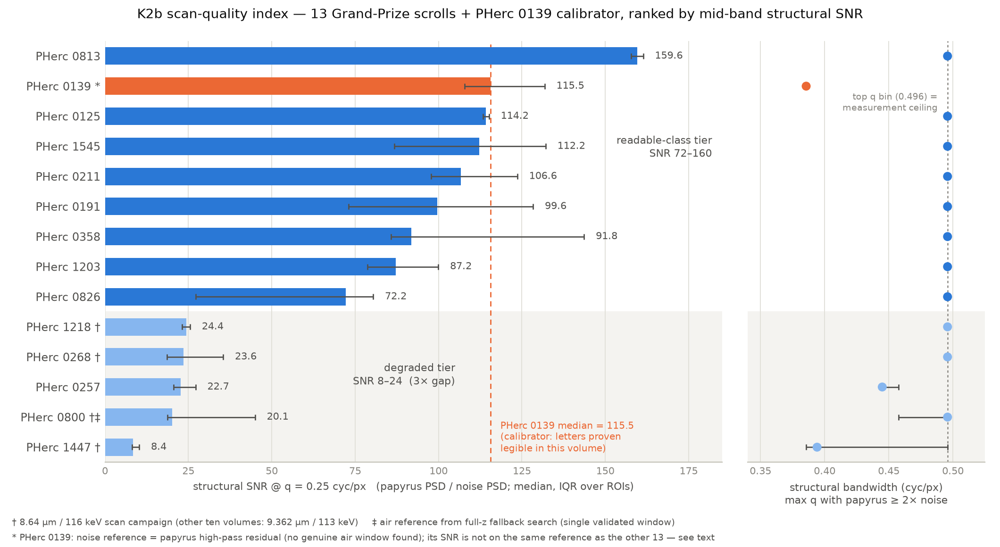

# 1. A scan-quality / detectability index for the 13 Grand-Prize scrolls

I built this because I could not find out which scroll to spend money on. There are thirteen Grand-Prize scrolls, the released scans are not equally good, and nobody had published a number saying which ones are even in the quality class where reading is possible. I wanted that number before I rented a GPU, not after.

We measured every released Grand-Prize 9 µm-class volume (13 scrolls) plus PHerc0139 — the one scroll where letters have been recovered at native 9.362 µm resolution — with three spectral/dynamic-range metrics, each referenced against the *same volume's own measurement noise*. The result is a two-tier ranking with a 3× gap between tiers, a clean correlation with scan campaign, and one explicit censoring caveat (uint8 window clipping).

Everything in this section is a property of the **released volumes** (post-reconstruction, post-Paganin/unsharp, uint8-windowed) — not of the scrolls' ink content and not of the raw beamline. See §1.7.

## 1.1 Method

Script: `trackD/k2b_detectability_index.py`; per-scroll outputs `trackD/out/k2b_index/*.json`. The design follows the surviving prescriptions of the K1/K2 adversarial audit (`trackD/qc/k1_k2_review.md`, "Deliverable shaping"): multiple papyrus ROIs with a fixed documented selection rule, a validated in-volume air noise reference, statistics restricted to the per-axis band q ≤ 0.5 cyc/px, and exactly the three metrics that survived review. Deprecated by that audit and absent here: quantization-floor crossovers, any |q| > 0.5 statistic, and slope-based "cliff" frequencies.

**Papyrus ROIs.** Per scroll, up to 5 target windows of 256³ voxels at level 0, picked at level 3 (level 4 when the level-3 central slab exceeds ~8·10⁸ voxels) from the central z-band (z ∈ [N/6, 5N/6]): highest 32-voxel-smoothed mean intensity subject to mask fill > 0.98, non-max suppression with centers ≥ 32 probe-level voxels apart. Fetched ROIs with < 90 % in-mask voxels are dropped; realized n = 2–5 per scroll (median 4). The rule deliberately targets bright, fully-filled (dense, papyrus-rich) regions — the audit's W8 showed "papyrus-rich" under-specifies the measurement, so the rule is fixed and stated rather than optimal. **§1.8 measures what that under-specification costs, and it is not small: the intensity-max rule lands preferentially on mineral incrustation rather than on laminated papyrus, in all 14 scrolls.** Read §1.8 before quoting any per-ROI number from this section.

**Noise reference (per scroll).** Two air-candidate windows from the same volume (central band, fill > 0.95, smoothed intensity below the 12th in-mask percentile). Every candidate must pass validation: mean in-mask DN < 0.5× the scroll's papyrus mean, and radial-PSD flatness (median power at q 0.18–0.30 ÷ median at 0.36–0.48) < 40 — genuine air measures 11.7–36.2 on this statistic across this corpus, papyrus ~80–200, so the gate rejects dark-papyrus impostors (the failure mode the audit caught in W9). Partially masked candidates are salvaged only via a fully in-mask ≥ 64³ sub-cube. If no primary candidate survives, a full-z fallback search (128³ windows, 0.85 fill gate) supplies more candidates under the same validation. If *nothing* survives, the scroll gets a **secondary residual reference** — a white-noise floor estimated from the papyrus ROIs' own 3×3×3 high-pass residuals, gain-corrected by |1−U|², read in the 0.35–0.48 cyc/px band — and is flagged `noise_ref: "residual"`. A dark-papyrus stand-in is never used.

**Metrics** (per papyrus ROI, against the median validated-air PSD; radial PSDs from Hann³-windowed 3-D FFTs, 59 q-bins on [0, 0.5] cyc/px):

1. **Structural bandwidth** — the largest q (bins up to 0.4958) at which papyrus PSD ≥ 2× noise PSD. "How fine is the detail that exists above this volume's own noise."
2. **Structural SNR @ q = 0.25 cyc/px** — papyrus/noise power ratio at a fixed mid-band, stroke-relevant scale (18.7 µm half-period at 9.362 µm voxels). This is the graded number that can actually rank scrolls; bandwidth saturates at the measurement ceiling for most of them.
3. **DN headroom** — in-mask p99.5 − p0.5 spread in DN (window utilization). Censored by clipping in most scrolls; see §1.6.

Each is reported as **median [q25–q75] over the scroll's ROIs** (audit W8: single-ROI PSDs vary site-to-site by up to ~25× at high q; medians over ≥ 5 ROIs with IQRs are the prescribed mitigation — at n = 2–5 realized, the IQRs below are the honest width of what we sampled, not a confidence interval).

**Verification.** Twelve of the fourteen results were independently recomputed from the cached ROI cubes with the final code path (`trackD/report/scripts/verify_index_air_refs.py`, output `verify_index_air_refs.json`): all twelve primary-air scrolls reproduce their shipped medians exactly. That script exercises only the primary-air path, so it does not cover PHerc0800 (single fallback window) or PHerc0139 (residual reference); both were recomputed separately and also reproduce exactly. Twelve scrolls' JSONs predate the `noise_ref` field; the recompute confirms both primary air windows pass the current validation gates in all twelve (validated windows across the corpus: mean DN 43.4–71.4, flatness 11.7–36.2). PHerc0800's primary candidates failed the DN gate (73.1/74.8 DN vs gate 68.8) and its reference is a single validated fallback window (64³ in-mask sub-cube, 43.4 DN, flatness 11.7) — a weaker, n = 1 reference. The k2b picker found no usable air window in PHerc0139 — its primary picker returned no air candidates at all, and all eight full-z fallback candidates were rejected for coverage (0.18–0.60 fill, no fully in-mask 64³ sub-cube) — so the shipped row carries the residual reference. A genuine clean air window in this volume does exist: the K2 audit's variance-aware search found one (128³, mean 50.0 DN, zero-fraction 0, `qc/qc_k2_air0139.json`), and it passes the current validation gates (50.0 DN against a 63.0 gate; flatness 24.6 against a 40 gate). Re-referencing the index's own three PHerc0139 ROIs against it is the like-for-like measurement, and we report it in note ⁽ᵃ⁾.

## 1.2 Ranked index — all 14 volumes

Ranked by median structural SNR @ q = 0.25. Campaign = voxel pitch / beam energy from the released volume id. Half-period = bandwidth median converted at the volume's voxel pitch.

| # | Scroll | Campaign | n ROIs | Bandwidth (cyc/px) med [IQR] | ≙ half-period | SNR @ 0.25 med [IQR] | DN headroom med [IQR] | Noise ref |
|---|--------|----------|--------|------------------------------|---------------|----------------------|------------------------|-----------|
| 1 | PHerc0813 | 9.362 µm / 113 keV | 2 | 0.4958 [0.4958–0.4958] | 9.4 µm | **159.6** [157.8–161.4] | 221 [219–223] | air (2) |
| 2 | **PHerc0139** (calibrator) | 9.362 µm / 113 keV | 3 | 0.3856 [0.3856–0.3856] ⁽ᵃ⁾ | ≤ 12.1 µm ⁽ᵃ⁾ | **115.5** [107.8–131.8] ⁽ᵃ⁾ | 151 [147–153] | residual |
| 3 | PHerc0125 | 9.362 µm / 113 keV | 2 | 0.4958 [0.4958–0.4958] | 9.4 µm | 114.2 [113.3–115.2] | 221 [220–222] | air (2) |
| 4 | PHerc1545 | 9.362 µm / 113 keV | 5 | 0.4958 [0.4958–0.4958] | 9.4 µm | 112.2 [86.7–132.1] | 223 [223–225] | air (2) |
| 5 | PHerc0211 | 9.362 µm / 113 keV | 5 | 0.4958 [0.4958–0.4958] | 9.4 µm | 106.6 [97.8–123.7] | 221 [218–223] | air (2) |
| 6 | PHerc0191 | 9.362 µm / 113 keV | 4 | 0.4958 [0.4958–0.4958] | 9.4 µm | 99.6 [73.1–128.4] | 229 [228.3–231] | air (2) |
| 7 | PHerc0358 | 9.362 µm / 113 keV | 5 | 0.4958 [0.4958–0.4958] | 9.4 µm | 91.8 [85.8–143.7] | 232 [225–244] | air (2) |
| 8 | PHerc1203 | 9.362 µm / 113 keV | 3 | 0.4958 [0.4958–0.4958] | 9.4 µm | 87.2 [78.7–100.0] | 212 [203–224] | air (2) |
| 9 | PHerc0826 | 9.362 µm / 113 keV | 5 | 0.4958 [0.4958–0.4958] | 9.4 µm | 72.2 [27.2–80.4] | 222 [152–222] | air (2) |
| 10 | PHerc1218 | 8.64 µm / 116 keV | 4 | 0.4958 [0.4958–0.4958] | 8.7 µm | 24.4 [23.2–25.5] | 218.5 [215.3–222.3] | air (2) |
| 11 | PHerc0268 | 8.64 µm / 116 keV | 5 | 0.4958 [0.4958–0.4958] | 8.7 µm | 23.6 [18.6–35.5] | 209 [183–211] | air (2) |
| 12 | PHerc0257 | 9.362 µm / 113 keV | 4 | 0.4449 [0.4449–0.4576] | 10.5 µm | 22.7 [20.5–27.2] | 143.5 [136.5–166.8] | air (2) |
| 13 | PHerc0800 | 8.64 µm / 116 keV | 3 | 0.4958 [0.4577–0.4958] | 8.7 µm | 20.1 [18.7–45.0] | 146 [138–169] | air-fallback (1) |
| 14 | PHerc1447 | 8.64 µm / 116 keV | 5 | 0.3941 [0.3856–0.4958] | 11.0 µm | **8.5** [8.1–10.3] | 125 [119–134] | air (2) |

⁽ᵃ⁾ PHerc0139's row is on the residual reference and is **not on the same footing as the other 13**. For bandwidth the residual floor overestimates high-q noise (any leftover structure inflates it), so 0.3856 is a lower bound — the K2 audit's independent air-referenced measurement of the *same volume* (different papyrus site, clean 128³ air window) put the 2×-noise crossing at q = 0.499, i.e. essentially Nyquist (`trackD/qc/qc_k2_air0139.json`). For SNR @ 0.25 the bias runs the *other* way: genuine scan noise is colored (its PSD at q 0.18–0.30 sits 11.7–36.2× above its 0.36–0.48 level across this corpus's validated air windows — that is exactly the flatness statistic), so a white floor read at high q *understates* the noise at 0.25 and the residual-referenced 115.5 is biased high. (The script docstring's claim that residual-referenced values are uniformly conservative assumes white noise; it holds for bandwidth, not for mid-band SNR.) The same audit measurement gives an air-referenced papyrus/air of 39× at q = 0.25 for its (single, different) site. The honest statement for 0139 is a bracket: SNR @ 0.25 somewhere in the ~39–116 range depending on reference and site; bandwidth ≥ 0.386, plausibly ≈ Nyquist.

Figure source: `trackD/report/scripts/make_index_ranking.py` (reads the per-scroll JSONs directly).

## 1.3 The two-tier finding

The 14 volumes split cleanly into two tiers on the graded metric:

- **Readable-class tier** (9 volumes: 8 GP scrolls + the 0139 calibrator): median SNR @ 0.25 between 72.2 and 159.6.
- **Degraded tier** (5 GP scrolls: 1218, 0268, 0257, 0800, 1447): median SNR @ 0.25 between 8.5 and 24.4.

The gap between the tiers is a factor of **3.0** (24.4 → 72.2) with no scroll inside it. Within-tier ordering, by contrast, is *not* robust: IQRs of adjacent ranks overlap heavily (e.g. ranks 3–7 span medians 91.8–114.2 with individual-ROI values crossing throughout), so we treat the index as a 2-class label plus a rough order, not a precise ranking.

Site-level honesty: the tier split is a statement about scroll medians. Individual ROIs cross it — PHerc0826's five sites span 22.6–160.6 (its q25 of 27.2 is inside the degraded range), and PHerc0800's and PHerc0268's upper quartiles (45.0, 35.5) reach toward the readable tier. Scan quality varies within a scroll; five 256³ windows are a sparse sample of a ~10¹¹-voxel volume.

Bandwidth is the less informative metric here, for a good reason: **11 of 14 medians sit at the top measurable q-bin (0.4958)** — structure exceeds 2× noise everywhere we can measure, i.e. those volumes are sampling-limited, not noise-limited, consistent with the K2 audit's B3 finding. Bandwidth therefore cannot rank them; it only flags the exceptions: PHerc0257 (0.4449 → 10.5 µm half-period), PHerc1447 (0.3941 → 11.0 µm at its finer voxel pitch), and PHerc0139's conservative residual-referenced 0.3856 (see note ⁽ᵃ⁾).

## 1.4 The scan-campaign effect (observed correlation, not established cause)

The 14 volumes come from two acquisition configurations (read from the released volume ids in `trackD/meta/*.json`): **8.64 µm / 116 keV** (PHerc0268, 0800, 1218, 1447) and **9.362 µm / 113 keV** (the other ten, including 0139).

Observed: **all four 8.64 µm / 116 keV scrolls are in the degraded tier; eight of the nine GP scrolls at 9.362 µm / 113 keV are in the readable-class tier.** The exception is PHerc0257 — scanned at 9.362 µm / 113 keV, yet degraded (SNR 22.7, and the only air-referenced scroll whose bandwidth median is below the ceiling). Contingency over the 13 GP scrolls: 4/4 degraded in one campaign vs 1/9 in the other; Fisher exact p = 0.007. PHerc0257 matters: it shows the degraded class also occurs *within* the nominally good campaign, so campaign membership is not the whole story.

We state this as a correlation and stop there, because the confounds are structural:

- n = 4 vs 9; a single Fisher test on a post-hoc split.
- The campaigns differ in voxel pitch, beam energy, *and* acquisition batch simultaneously (volume-id timestamps: three of the 8.64 µm volumes carry May 2025 ids, one Nov 2025; all ten 9.362 µm ids are Jul–Aug 2025 — these may be processing rather than scan dates), plus any unrecorded differences in dose, optics, or reconstruction settings.
- Scroll assignment to campaigns was presumably not random; physical condition covaries.
- A fixed-q comparison is mildly unfair to the finer-pitch campaign: q = 0.25 cyc/px is an 8 % smaller physical scale at 8.64 µm voxels (17.3 vs 18.7 µm half-period), which depresses their SNR at fixed q. The magnitude is estimable: the air-referenced SNR log-slope near q = 0.25 is ≈ 3.2–4.4 (audit B3 tables: papyrus/air falls 29–39× → 6.8–13.5× between q = 0.25 and 0.35), so evaluating the 8.64 µm scrolls at the matched physical scale would raise their SNR by roughly 1.3–1.4× — lifting 1218/0268 from ~24 to ~33, still ≥ 2.1× below the readable tier's bottom. The confound is real but cannot close the gap, and it does not touch PHerc0257 at all. We did not apply the correction to the reported numbers.

The practical reading is selection, not diagnosis: **if a target list is being ordered by scan quality, the four 8.64 µm / 116 keV volumes and PHerc0257 currently measure 3.0–8.5× below the bottom of the readable tier**, whatever the cause.

## 1.5 The PHerc0139 calibrator anchor

PHerc0139 is the one volume in this set where recovering letters at native 9 µm-class resolution is *proven*, not hypothesized: segment w035 carries human ink-label annotations, the community result found letters there, and our own stack reproduces it — AUC 0.9991/0.9982 (two seeds) against the human labels in the initial control run, 0.964 in a later pixel-level recompute (`trackD/LOG.md`, 2026-08-17 entries), with the rendered letters legible in `trackD/out/ink9um_w035_control.png`. I have looked at that figure myself, and the shapes in it are letters. I want to be exact about what that sentence covers: it is the only place in this report where I call a model output letters, the labels there were made by a human before I touched the data, and everywhere else "detection" means a number, not a reading.

That makes 0139 a **calibration point for the index**: its measured scan quality is, by construction, sufficient for letter recovery by our instrument. The anchor survives 0139's noise-reference ambiguity (note ⁽ᵃ⁾) because the tier split brackets it on both sides:

- Every readable-tier scroll's median SNR @ 0.25 (72.2–159.6) exceeds the *site-matched* air-referenced 0139 value (20.6) by ≥ 3.5×, and exceeds even the highest of the four PHerc0139 papyrus sites we have measured on a common air reference (38.6) by ≥ 1.9×.
- The degraded tier (8.5–24.4) *straddles* the site-matched 0139 value: PHerc1218 (24.4), PHerc0268 (23.6) and PHerc0257 (22.7) measure at or above it; PHerc0800 (20.1) and PHerc1447 (8.5) below. On a like-for-like reference the index does not separate the degraded tier from the calibrator, and no claim about the degraded tier can be anchored on 0139.

And at line 91 replace the bolded conclusion with: **the eight readable-tier GP scrolls measure 1.9–8× above every PHerc0139 papyrus site we have measured on a common air reference, i.e. their scan quality is in the class where our instrument provably reads letters; the degraded tier does not separate from the calibrator on that reference, so this section makes no claim about it.**

So the defensible anchor statement is: **the eight readable-tier GP scrolls have scan quality in the class where our instrument provably reads letters; the five degraded-tier scrolls measurably do not reach that class in the released volumes.** Note the direction of the inference: readable-tier quality is *necessary-class*, not sufficient — 0139 also needed ink that images and a segmented surface to render (§1.7). Conversely, degraded-tier quality does not prove letters are unrecoverable there (models may tolerate noise the index penalizes); it proves their released volumes carry 4.7–13.7× less mid-band structural SNR than PHerc0139 on the residual reference (1.6–4.6× on the conservative air-referenced bracket).

## 1.6 Caveat: uint8 window clipping censors the DN-headroom metric (and bright-ink screens)

All 14 volumes share one render window (f32 [−0.03, 0.145] → uint8, verified identical in the creation metadata), which makes DN values cross-comparable — and clips dense material wholesale. Measured on the same 55 papyrus index cubes (comb dense-ink scan, `trackD/comb/dense_scan.json`; threshold DN ≥ 250):

| Scroll | sat. fraction, min–max across cubes | | Scroll | sat. fraction, min–max across cubes |
|---|---|---|---|---|
| PHerc0125 | 8.9–9.0 % | | PHerc0813 | 5.7–15.5 % |
| PHerc0139 | **0.07–0.19 %** | | PHerc0826 | 0.13–4.4 % |
| PHerc0191 | 17.0–**34.0 %** | | PHerc1203 | 2.7–26.7 % |
| PHerc0211 | 4.5–13.7 % | | PHerc1218 | 11.3–15.9 % |
| PHerc0257 | 0.07–2.7 % | | PHerc1447 | 0.04–0.09 % |
| PHerc0268 | 6.0–22.5 % | | PHerc1545 | 1.2–5.9 % |
| PHerc0358 | 2.1–20.5 % | | PHerc0800 | 0.02–4.0 % |

Nine of 14 scrolls have at least one papyrus cube above 5 % saturation (five have *every* cube above 5 %); the worst single cube is PHerc0191 at 34.0 %. (`trackD/LOG.md`'s comb entry quotes "5–33 % in 8/14" from the same data under a slightly different per-scroll cut; the table is the primary record.)

Consequences, stated as censoring rather than error:

1. **DN headroom is censored from above in the clipped scrolls.** With ≥ 0.5 % of voxels pinned near 255, p99.5 saturates by definition, and headroom collapses toward (255 − p0.5). The 209–232 DN headroom readings of the heavily clipped scrolls measure the window, not the scroll. Headroom remains meaningful only where saturation is low — and there it is informative: PHerc0139 (0.07–0.19 % saturated) genuinely uses ~151 DN of the window; its low headroom is real, not censoring.
2. **Bright-ink screens are censored in the clipped scrolls.** Any dense (PHerc172-class, metal-bearing) ink brighter than the clip point is indistinguishable from clipped papyrus. The comb's dense-ink null — no PHerc172-class signature in any of the 55 cubes — is therefore evidence of absence only in the low-saturation scrolls; in the 5–34 %-clipped ones it is a censored measurement, not a null.
3. **Effect on the two spectral metrics: unquantified.** Clipping both removes top-end structure and injects broadband edge power (the K2 audit's W6 measured clip-error PSD reaching ~2× the quantization floor at a 10⁻³ clip fraction; the %-level fractions here were not synthetically modeled). We do not correct bandwidth or SNR for it; ranks 1–9 vs 10–14 are unlikely to be an artifact of it, since the tier split does not track the saturation ordering (e.g. 0191 at 17–34 % is readable-class; 1447 at 0.04–0.09 % is the worst scroll in the index).

## 1.7 What the index is NOT

- **Not an ink detector.** All three metrics are computed on bare papyrus ROIs; nothing here observes ink contrast. A readable-class score means the released volume carries papyrus structure well above its own noise at stroke-relevant scales — it says nothing about whether inked text exists in that scroll or whether carbon ink modulates the signal there.
- **Not a promise of readability.** The 0139 anchor is one-directional (necessary-class, §1.5). 0139 also had a segmented, rendered surface with human labels. The three metrics here do not measure segmentability or coverage — **§1.8 adds a second axis that measures the first of those**, and shows it is close to independent of everything in §1.2.
- **Not a beamline resolution measurement.** Metrics are taken on the released, preprocessed volumes (Paganin phase retrieval, unsharp, uint8 windowing included). They characterize what downstream methods can access — which is the decision-relevant quantity — not raw scanner performance.
- **Not a precise ranking.** Two-class label plus rough order (§1.3); adjacent-rank differences are inside the IQRs almost everywhere. The same caution applies to §1.8's ordering.
- **Not measured on typical papyrus.** The ROI rule samples each scroll's *brightest* dense windows, which are preferentially mineral incrustation (§1.8.1). Because every scroll is biased the same way the tier split survives, but no individual ROI value here should be read as describing that scroll's ordinary material.
- **Not fully reference-homogeneous.** Thirteen scrolls are air-referenced (0800 on a single fallback window); 0139 is residual-referenced, with a documented bias direction per metric (note ⁽ᵃ⁾). The one cross-check we have (the K2 audit's clean-air measurement of 0139) brackets, and does not overturn, its placement.

**Reproduce:** `python trackD/k2b_detectability_index.py` (resumable; streams from the public S3 bucket; caches ROI cubes to `D:\vesuvius-data\trackD\k2b`), then `python trackD/report/scripts/verify_index_air_refs.py` and `python trackD/report/scripts/make_index_ranking.py`.

## 1.8 The second axis: sheet separability — and a correction to §1.1's ROI rule

Scan quality is not the quantity that decides whether a scroll can be read. A volume can be quiet and well-resolved and still be useless if its papyrus sheets are fused into a mass no segmentation can follow; a noisy volume with cleanly separated lamellae can be traced. §1.1's index measures the first thing. This subsection measures the second, on the same 14 volumes, and the two turn out to be close to independent.

**The statistic.** For each 256³ ROI, split into 32³ blocks (≈ 0.3 mm), and in each block take the structure tensor of the smoothed gradient, `J_ij = ⟨g_i g_j⟩`. Its eigenvalues give a planarity, `(λ1 − λ2)/(λ1 + λ2)`: near 1 when the local gradients all point along one axis, as they do across a stack of sheets; near 0 when they point every way, as in granular incrustation. Separability is the **median planarity over in-material blocks**. Because it is a normalized eigenvalue ratio it is invariant to overall contrast — it cannot merely restate §1.1's SNR. Scripts: `k2c_separability.py`, `k2c_analyze.py`.

**The floor, measured rather than assumed.** Finite-sample eigenvalue repulsion puts the statistic above zero even on structureless material, so the null was measured: **28 real in-scan air windows read 0.105 median (0.050–0.287)**, and synthetic isotropic noise reads 0.017–0.119 depending on correlation length (`out/k2c_separability/isotropy_floor.json`).

**A null that had to be discarded.** A phase-randomization test was written first, on the reasoning that preserving the power spectrum while destroying spatial structure would show whether the statistic measures structure or merely spectrum. It is **invalid here**: by Parseval, `J_ij = Σ_q q_i q_j |F(q)|²`, so the structure tensor depends only on the power spectrum and is phase-blind *by construction*. The test could not have failed. Confirmed numerically on a single block (observed 0.9968 against phase-randomized 0.977–0.994) and removed. The honest description is narrower and still useful: separability is the **angular** anisotropy of gradient power, where §1.1's SNR is a **radial** property of the same spectrum. Different features of one spectrum, not "structure beyond the spectrum."

### 1.8.1 The ROI rule samples the wrong material

§1.1's papyrus rule scores candidates `np.where(fill > 0.98, inten, 0)` and takes the highest — the **brightest** dense windows in each scroll. Testing that choice required changing exactly one thing: same central-z band, same `fill > 0.98` gate, same 256³ size, same non-max separation, candidates drawn **uniformly at random** instead of by intensity. Twenty-four uniformly-random ROIs per scroll (the PHerc0800 frame yields 16), 328 cubes across all 14 volumes, seed 20260818; the earlier 12-ROI pass is a deterministic prefix of these draws.

| across all 14 scrolls | intensity-max (as shipped) | uniform random (same frame) |
|---|---|---|
| separability, pooled median | **0.168** | **0.564** |
| separability, per-scroll median: range | 0.118 – 0.456 | 0.317 – 0.744 |
| ROI mean DN, per-scroll median: range | 127 – 174 | 80 – 122 |
| ROI saturation (DN ≥ 255), per-scroll median | 0.039 (up to 0.20) | 0.0004 (up to 0.0015) |

**The random frame scores higher in 14 of 14 scrolls; median ratio 3.00×; Mann-Whitney p = 3.6 × 10⁻²⁸.** **Twelve of the 14 scrolls' intensity-picked medians fall below 0.22**, against an air floor of 0.105 — barely above structureless — while randomly-sampled material from the *same scrolls* runs 0.337–0.748. The picked ROIs are also 24–68 DN brighter than typical papyrus in every scroll. The two exceptions prove the mechanism rather than break it: PHerc0139 (picked 0.456) and PHerc0358 (0.360) are the two scrolls whose picked windows happened to be almost unsaturated, and they are exactly the two with the *smallest* bias ratios (1.63× and 1.98×). Rendered slices make the mechanism plain: the picked cubes are bright granular conglomerate with large mineral inclusions and cracks; the random cubes are laminated papyrus. The picker takes the extreme upper tail of a 29–122 million-location candidate frame, and in a carbonised scroll that tail is incrustation.

This is the failure mode this project's corrections ledger names most often (§4.3): *a reference class that silently contains something other than what it names.* §1.1 already flagged that "papyrus-rich" under-specifies the rule; the measurement above is what the under-specification costs.

**What this does and does not invalidate.** The three §1.1 metrics are computed against each scroll's own noise, and every scroll's ROIs are biased the same way, so the **tier split and the campaign correlation are not overturned** — the ordering is a comparison of like with like, and the bias ratio does not track the tier boundary (it runs 1.63–4.46 across both tiers). What is affected is the **interpretation of any individual ROI value**: §1.1's numbers describe the densest material in each scroll, not its typical papyrus. That distinction was not stated in §1.1 and should have been.

### 1.8.2 The ranked separability axis

| rank | scroll | n | separability [95 % CI] | K2b SNR rank | published segments |
|---|---|---|---|---|---|
| 1 | **PHerc0139** (calibrator) | 24 | 0.744 [0.719–0.760] | 2 | — |
| 2 | **PHerc0358** | 24 | 0.713 [0.699–0.743] | 7 | — |
| 3 | PHerc0813 | 24 | 0.662 [0.615–0.697] | 1 | — |
| 4 | PHerc0826 | 24 | 0.640 [0.548–0.682] | 9 | — |
| 5 | PHerc1447 | 24 | 0.610 [0.580–0.686] | **14** | **52** |
| 6 | PHerc0800 | 16 | 0.563 [0.506–0.648] | 13 | 6 |
| 7 | PHerc1203 | 24 | 0.555 [0.534–0.581] | 8 | 22 |
| 8 | PHerc1545 | 24 | 0.549 [0.487–0.607] | 4 | — |
| 9 | PHerc0211 | 24 | 0.543 [0.471–0.593] | 5 | — |
| 10 | PHerc1218 | 24 | 0.526 [0.402–0.607] | 10 | — |
| 11 | PHerc0191 | 24 | 0.525 [0.447–0.618] | 6 | — |
| 12 | PHerc0125 | 24 | 0.424 [0.366–0.494] | 3 | — |
| 13 | PHerc0257 | 24 | 0.385 [0.315–0.479] | 12 | — |
| 14 | PHerc0268 | 24 | 0.317 [0.274–0.376] | 11 | — |

CIs are bootstrap over each scroll's ROIs (4,000 resamples). Many still overlap — as with §1.3 this is **tiers plus a rough order, not a strict ranking** — though doubling n from the original 12-ROI pass moved only one scroll more than a single rank: PHerc1218 (0.389 → 0.526), exactly the scroll whose 12-ROI interval [0.33–0.61] had flagged it as the least determined.

Three things validate the axis, none of which it was tuned on:

1. **The calibrator ranks first.** PHerc0139 — the one volume where letter recovery at native 9 µm is proven (§1.5) — scores highest of all 14 — 0.744 [0.719–0.760], the tightest CI of any scroll. Nothing in the statistic knows which scroll has letters.
2. **It is not a restatement of scan quality.** Spearman ρ against §1.2's SNR is **+0.266 (p = 0.36, n = 14)**. The inversions are the substance: PHerc0813 is SNR rank 1 but separability rank 3; PHerc0125 is SNR rank 3 but separability rank 11; PHerc1447 is SNR rank **14** and separability rank **5**.
3. **It survives its own parameters.** Recomputing at block 16/32/64 and smoothing σ 0.5/1.0/2.0, holding the ROIs fixed, leaves the ordering essentially unchanged: Spearman ρ against the shipped setting runs **+0.978 to +0.996** across all 14 scrolls (`out/k2c_separability/sensitivity.json`; the sweep uses 8 of each scroll's ROIs for speed, so its absolute values differ slightly from the table above — the claim it supports is stability under parameter change, not the levels).

A clipping confound was tested directly and refuted, in the conservative direction: artificially clipping the PHerc0139 cubes to drive saturation from 0.001 to 0.37 — worse than any real scroll in §1.6 — moves separability **up**, 0.456 → 0.525, 0.565 → 0.594, 0.412 → 0.483. Low-separability scrolls are therefore not low because they are clipped.

**External check, and its limits.** The three scrolls the community has actually segmented sit at separability ranks **5, 6 and 7 of 14** but SNR ranks **8, 13 and 14**. The sharpest case is PHerc1447: the **worst-scanning volume in the whole index** (SNR 8.5, rank 14) carries **more published segments than any other scroll** (52). Scan quality says do not bother; separability puts it fifth. This is n = 3 against 11 and confounded with community attention, so it is a qualitative inversion rather than a test (Mann-Whitney p = 0.277) — but it is the direction the axis predicts and the opposite of what SNR predicts.

### 1.8.3 What the axis is for

The decision it informs is *where to grow surfaces next* — and it has now been acted on: on 2026-08-25 the **first surfaces ever grown on PHerc0358** (8 patches, ≈ 69 cm², current-main tracer, seeds drawn from this axis's own highest-separability ROIs and pre-verified on-sheet) all pass the mesh-vs-lamella gate at **3.6–18.6° measured locally** — inside the published-mesh population. The axis picked the scroll, picked the seed sites, and the gate that caught every failure in §2.9 vetted the result (`hunt/pherc0358_first_surfaces/`, `alignment_gate.json`). One observation stays open: all eight grids are identically 152×152 with identically 21,904 valid vertices — extent set by the generation budget, not by sheet boundaries. The published record is mixed on whether that matters (a healthy published PHerc1203 mesh is also a full 152² at the same generation count; a healthy PHerc0800 mesh shows 47 % real rejection), so it is recorded as an open observation, with the ink screen as the next discriminator. On this axis the best untried target is **PHerc0358** (0.713, rank 2, and only rank 7 on scan quality) followed by **PHerc0826** (0.634). PHerc0813, which §1.2 ranks first on scan quality, is a reasonable third — and §2.9's finding that our own patches there showed almost no lamella contrast turns out **not** to be a property of the scroll (§2.9.1). Per-ROI coordinates and scores for every scroll are published in `out/k2c_separability/<scroll>.json`, so growth can be seeded at material measured to be laminated rather than wherever a picker lands.

**Reproduce:** `python trackD/k2c_separability.py` (resumable, streams from public S3, caches to `D:\vesuvius-data\trackD\k2c`), then `python trackD/k2c_analyze.py` and `python trackD/report/scripts/make_separability_figure.py`.
