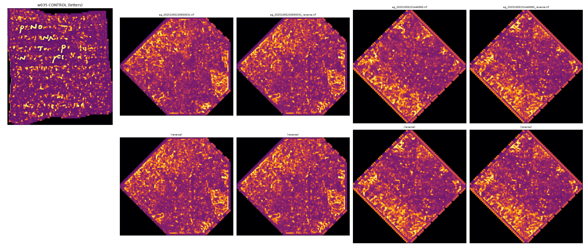

# 2. A validated cross-scroll ink instrument, and a screen of the entire published Grand-Prize segment corpus

The usual way to hunt ink is to pick a promising patch and look hard at it. I did the opposite, for one reason: if you only ever look where you hope, you cannot tell a real detection from a lucky patch. So I checked the instrument against letters a human has already verified, then pointed it at every published Grand-Prize segment that exists — all of them, including the unpromising ones — and let the result be whatever it was.

## 2.1 Design philosophy: the control comes first

This project had already produced two refuted false positives before this experiment ran, so the design rule for the ink probe was fixed in advance: **no statistic about an unread scroll is reported without (a) a positive control that passes it and (b) a matched null that the claim must beat.** The instrument described here is the combination of three things:

1. the published `scrollprize/ink_9um` model (hybrid 3D-stem/2D UNet, ~34 M parameters, input patch 17×128×128, fp16 inference), run unmodified;
2. a custom surface-volume renderer that makes the model runnable on any tifxyz mesh of any 9 µm scroll volume;
3. a four-test text-detection battery, calibrated on a scroll segment with human-verified letters, with every test scored against a texture-preserving null.

The battery's job is not to find ink. Its job is to say, with numbers, whether a prediction map is organized like text or organized like the model's response to blank papyrus — and to be demonstrably capable of saying "text" when text is present.

A pipeline constraint discovered up front (documented in `runpod/ink9um_runbook.md`): all 14 released ink_9um checkpoints embed `mode: "flat"`, and the native-3D inference path (`infer_full3d_tifxyz`) hard-refuses flat checkpoints. The only runnable path for a scroll without a published surface volume is therefore render-then-infer: sample a 21-slice surface volume from the tifxyz mesh (trilinear samples at surface + t·normal, t = −10..+10 voxels), then run flat inference. That renderer is ours, so it had to be validated separately (§2.3).

## 2.2 Positive control: the model re-finds the w035 letters

PHerc0139 segment w035 is the published demonstration that letters are recoverable at native 9 µm resolution, and it comes with human ink labels. We ran ink_9um (seed42 and seed43, step-075000) on the published 28-slice surface volume (5820×5240 px at 9.362 µm) in both z-directions.

| run | pixel AUC vs human labels | frac > 0.5 |
|---|---|---|
| seed42, forward | **0.9991** | 0.122 |
| seed43, forward | **0.9982** | 0.119 |
| seed42, z-reversed | 0.5123 | 0.089 |
| seed43, z-reversed | 0.5844 | 0.079 |

(Scores: `out/ink9um_w035_scores.json`, script `score_w035_control.py`. The verdict battery later recomputed AUC under a stricter eroded mask and sampled positives: 0.964 on 29,385 label pixels — the same conclusion under a different mask.)

Two things follow. First, this independently reproduces the published claim that w035's letters are detectable at native 9 µm — our stack, our download, our inference, letters plainly legible. Second, the forward/reverse asymmetry (0.999 vs ~0.5) shows the model reads ink on one face of the sheet: destroying z-orientation destroys the detection. That asymmetry becomes a diagnostic in Test 3 of the battery.

![Positive control on PHerc0139 w035: ink_9um seed42 prediction (left, AUC 0.999), human ink labels (center), prediction under the supervision mask with label contours (right). The letters are human-verified; this is the one panel in this report where "letters" means letters. Two label contours near the bottom of the right panel are empty because those letters lie entirely outside the supervision mask and are therefore excluded from scoring — the model in fact fires on them too (mean 129–144 DN against a 57 DN background), but unscored pixels are not shown.](../figures/ink9um_w035_control.png)

Calibration numbers extracted from the labels themselves (`salvage/verdict_labelgeom.json`): letter height p50 = 242 px = 2.26 mm, row spacing ≈ 490 px = 4.59 mm, stroke width 68 px = 0.64 mm. These set the search bands for every test below — the battery hunts at the scale text actually has on this scroll, not at a guessed scale (our prior guess of 35–55 px letter height was 6× off).

## 2.3 The render pipeline, and its validation

The renderer (`runpod/ink9um_runbook.md`, script `render_tifxyz_sv.py`) reads a tifxyz quadmesh, interpolates it to full resolution, computes normals from grid cross-products, and trilinearly samples the scroll volume into a 21-slice uint8 zarr the flat inference path accepts. Normal sign is not resolved globally; every inference is run in both z-directions.

Validation was end-to-end on the control: we re-rendered w035 from its mesh plus the raw PHerc0139 9 µm scroll volume — ignoring the published surface volume entirely — and ran the same inference. The re-rendered prediction correlates **r = 0.813** with the prediction on the published surface volume, and independently passes the battery's ruling test (4.68 mm ruling at z = +34.1; see Test 1 below). So the full render→infer path that every unread-scroll result depends on demonstrably preserves the letter signal on a scroll where letters exist.

Cost accounting: the instrument itself — checkpoints, control inference, the first PHerc1203 renders and inference — added $1.15 of cloud compute (project total at that point: $5.61). The corpus survey of §2.4 added ≈ $5.5.

## 2.4 The headline result: the entire published Grand-Prize segment corpus, screened

**Every published segment of every Grand-Prize scroll that has one was rendered and run through the validated instrument: 80 of 80 catalogue rows, 0 errors, 0 tripwire hits.** Three GP scrolls have a `segments/` prefix on `s3://vesuvius-challenge-open-data` — PHerc1203 (22 rows), PHerc1447 (52), PHerc0800 (6). All 80 completed. Nothing was hand-picked, and nothing was skipped for looking unpromising.

**Method, per segment** (`runpod/survey_segments.py`, pod-side; catalogue `runpod/segment_catalog.json`):

1. fetch the tifxyz mesh anonymously from S3;
2. render a 21-slice surface volume against that scroll's own 9.362 µm / 8.64 µm masked volume with the validated renderer (§2.3);
3. run `ink_9um` seed42 step-075000 in **both** z-directions (normal sign is not globally resolved, so both are always run);
4. record compact statistics, the **pre-registered tripwire** (§2.8), and the forward-vs-reverse map correlation;
5. keep a 4×-downsampled copy of each prediction map and delete the multi-GB intermediates.

Heavy analysis then ran on the laptop over the saved maps (`analyze_survey_corpus.py`, superseded by `analyze_survey_corpus_v2.py` — see below), so the GPU fleet only ever did render + inference. Four RTX 5090 pods, **6.34 GPU-hours** of segment wall time (`survey_all.json`, summed `secs`), ≈ **$5.5**. Retained: **150 prediction maps** (75 forward + 75 reverse). All 80 rows carry both forward and reverse statistics and tripwire results; five rows' downsampled maps are missing from the local pull, so only their periodicity re-analysis is unavailable.

**Scale of the screen.** Rendered-and-inferred surface, computed as canvas × non-zero fraction × voxel pitch² (`report/scripts/corpus_summary.py`):

| scroll | index rank (§1) | rows screened | unique surfaces | rendered area | non-zero canvas | half-max firing fraction | fwd/rev map r | tripwire |
|---|---|---|---|---|---|---|---|---|
| PHerc1203 | 8 (SNR 87.2) | 22 | 22 | 66.4 cm² | 0.57–0.72 | 0.032–0.229 | 0.399–0.747 | 0 |
| PHerc1447 | 14 (SNR 8.5) | 52 | 38 | 337.8 cm² | 0.002–0.711 | 0.002–0.183 | 0.222–**1.000** | 0 |
| PHerc0800 | 13 (SNR 20.1) | 6 | 6 | 11.8 cm² | 0.37–1.00 | 0.111–0.310 | 0.329–0.522 | 0 |
| **total** | | **80** | **66** | **416 cm²** (≈ 350 cm² deduplicated) | | | | **0** |

"Half-max firing fraction" is the survey's own health statistic — fraction of the whole canvas above half of that map's own maximum — not the probability threshold used in §2.5, and the two are not comparable. It is reported to show the maps are not degenerate: no map is uniformly blank, none is uniformly saturated.

The area figure is the surface the model actually saw, not the meshes' catalogued area; spot-checked against `meta.json` it runs ~15–20 % high on well-covered meshes and far below on sparse ones, which is the intended behavior (a render that covered a quarter of its mesh screened a quarter of that papyrus). For scale: the deep four-test probe of §2.5 covers ~28.5 cm² across two segments. **The corpus screen is ~15× larger and is the complete published inventory rather than a sample of it.**

**The decisive statistic, corpus-wide.** Every retained forward map was scored on the battery's Test 1 — best periodic row-signal prominence in the 1.7–8.4 mm ruling band, over all orientations, against a texture-preserving block-permutation null of that same map.

This screen was run twice. **The first pass (v1) was under-powered, and its own flag verification refuted it as a scorer** (§2.6): 16 permutations per map underestimated a heavy-tailed statistic's null standard deviation by 2.2×, and the rim erosion and detrending that the validated battery uses were skipped. Rather than report v1 with a caveat, the four prescriptions from that verification were implemented and **the entire corpus was re-scored** (`analyze_survey_corpus_v2.py`, protocol and before/after in `out/survey/PROTOCOL_V2.md`; 71.1 min on 30 workers, 15,477 scored maps). What follows is v2. The v1 numbers are retained only where they show how far a weak protocol can drift.

The hardened protocol scores a map on **five pre-registered gates**, not one number: empirical p ≤ 0.05 at 200 permutations; ≥ 6 cycles of the claimed period inside the profile; positive autocorrelation at 2× and 3× the period; the peak not in the search band's two lowest Fourier bins; and forward/reverse map correlation |r| < 0.20.

| population | n | ruling z: min | median | max | gates passed |
|---|---|---|---|---|---|
| **w035 control (human-verified letters)** | 1 | — | **+16.3** (CI +13.5…+20.1) | — | **5 of 5** |
| PHerc1203 | 20 | −1.20 | −0.49 | +1.49 | 0 of 5 |
| PHerc1447 | 48 | −0.86 | +0.06 | +4.64 | max 3 of 5 |
| PHerc0800 | 3 | −0.99 | −0.41 | +0.69 | 0 of 5 |
| **whole corpus** | **71** | **−1.20** | **−0.09** | **+4.64** | **0 of 71 pass all five** |

**Zero of 71 segments pass the screen; the control passes it 5 gates out of 5** — prominence 123.5 against a null of 20.0 ± 6.4, **empirical p = 0.00498 (0 of 200 permutations beat it)**, at 4.678 mm, 11.0 cycles, ρ(1P/2P/3P) = +0.65/+0.54/+0.46, peak in bin 4 of 24, fwd/rev r = 0.094. Zero segments pass even the four map-internal gates with fwd/rev dropped. The gate cascade is where the corpus dies:

| gate | segments passing, of 71 |
|---|---|
| `gate_significance` (empirical p ≤ 0.05) | 4 — against **3.55 expected under the null** |
| `gate_cycles` (≥ 6 cycles) | 19 |
| `gate_autocorr` (ρ(2P), ρ(3P) > 0) | 23 |
| `gate_band_bin` (peak not in the 2 lowest bins) | 23 |
| `gate_fwd_rev` (|r| < 0.20) | **0** |
| **all five** | **0** |

The minimum Holm-corrected p across the corpus is **0.354**. A second, band-constrained search sharing the same spectrum and null — added so the gates could not manufacture a false negative — also returns **0 survivors, corpus-best p = 0.0597**.

**Two corpus facts do most of the work, and neither needs the periodicity machinery.** First, `gate_fwd_rev` is 0 of 71: the lowest forward/reverse map correlation anywhere in the 80-segment survey is **0.222** (median 0.637), against the control's **0.055–0.094**. Ink sits on one face of a sheet, so reversing the render's z-order should destroy the signal; nothing in this corpus behaves that way. Second, **48 of 71 segments (68 %) put their best period in the search band's lowest one or two Fourier bins** — band-edge leakage, which is what a period-like number looks like when there is no period.

**How badly the first pass was calibrated, stated in full.** Run v1's own scorer on the control map and it returns **z = +13.74** — so v1 separated *known Greek letters* from its worst false positive by a factor of only 2.3 (v2: 3.5). The `+25.6…+34.1` control line printed on v1's `corpus_ranking.png` was never computed by v1 at all; it was quoted from the validated battery, a different protocol, making that figure's reference apples-to-oranges. Spearman ρ between v1's z and v2's across the 69 segments both scored is **+0.370**: four of v1's top five collapse, its #2 rises to the new top, and three segments v1 put at or below zero rise into v2's top eight. **v1's ordering was substantially permutation noise, not a weak signal.** The correction is symmetric rather than a thumb on the scale — the control's own z falls from +25.6 (5 nulls) to +16.3 (200 nulls), because the 5-draw null standard deviation was an underestimate too.

**The tripwire: 0 hits in 80 segments, 160 inferences.** The pre-registered rule (fixed before the survey ran, §2.8) is that any connected component above the control's blank-papyrus p99 (195 DN) with area > 10⁴ px and width > 30 px triggers a mandatory human look. Across all 80 segments in both z-directions, zero components met it. On the control the same rule fires at every threshold tested. This is the part of the screen that is deliberately not a statistic: it is a commitment made in advance about what would force us to look.

**The result, stated precisely: across 416 cm² of every published Grand-Prize segment surface, screened with an instrument that reproduces human-verified letters at AUC 0.999 on a control scroll, no segment shows text-like organization. Zero of 71 scorable segments pass a five-gate protocol that the human-verified control passes 5 of 5. The one segment that cleared the first pass's flag threshold was independently refuted, and then died a second time in the re-scored screen itself (§2.6). The model behaves correctly on all 80 and reports blank.** What that does and does not bound is §2.7, and it matters more than the result.

**Coverage, itemized** (none were dropped for looking uninteresting). 80 catalogue rows were surveyed; **75 have a saved prediction map; 71 were scored and 4 skipped**, each documented:

- 1 row is degenerate — `z_dbg_gen_00325_inp_hr`, eroded mask 0.1 % of canvas, and its forward/reverse correlation is **r = 1.000**: reversing the render's z-order changed nothing at all, because at 0.22 % canvas coverage there is almost no depth to reverse. The control's r is 0.055–0.094.
- 3 rows are too small to carry the band — post-erosion extent 5.4–6.4 mm against a requirement of 4× the band's shortest period (`auto_grown_20250929222256117`, `auto_grown_20250930000321811`, `z_dbg_gen_00070_inp_hr`).
- The 5 rows with no saved map have fwd/rev r = 0.33–0.64, so **`gate_fwd_rev` is decided for all 80** regardless of the periodicity analysis. Their per-segment statistics and tripwire results are in `survey_all.json`.

Two of the skipped rows are among the segments independently measured to lie mostly outside the scanned material (§2.7) — 95.7 % and 33.4 % of their vertices on zero-valued voxels. The admissibility gate and the geometry defect identify the same segments without being told about each other.

## 2.5 The calibration: PHerc1203 through the full four-test battery

The corpus screen runs one test at scale. The full four-test battery — the thing that establishes what the corpus screen's numbers mean — was run in depth on PHerc1203, the only readable-tier scroll in the corpus (§1, index rank 8, SNR 87.2), over eight prediction maps.

Segments (from `PHerc1203/segments/raw/`, rendered against the 9.362 µm masked volume):

| segment | mesh area | prediction canvas |
|---|---|---|
| A = `auto_grown_20251005230830031` | 16.1 cm² | 4639×5359 |
| B = `auto_grown_20251005231446965` | 12.5 cm² | 5199×5199 |
| `auto_grown_20251005221856743` | 11.8 cm² | render failed at the time (cause not diagnosed); rendered successfully in the corpus survey |

Eight prediction maps: 2 segments × 2 seeds × 2 z-directions (`out/ink9um_1203_stats.json`). First-order behavior is healthy, not degenerate: firing fraction (>0.5) 0.097–0.158 across the 8 maps, bracketing the control's 0.119–0.122; quiet regions exist; seeds agree (r = 0.51–0.60). This is explicitly **not** the round-1 ink_3d failure mode (scroll-wide blanket firing, no rankable tail — see §3.6–3.9). The maps are a structured, reproducible response to the volume. The question the battery answers is what kind of structure.

All 8 maps fail all four text signatures simultaneously; the control passes all four decisively.

Full analysis: `salvage/ink9um_1203_verdict.md`, scripts `salvage/verdict_*.py`. Map values below are model probability × 255 (uint8 DN).

**Test 1 — line-ruling periodicity.** Search all orientations for a periodic row signal in the 1.7–8.4 mm band; score peak prominence against a null of 5× block-permuted (256-px tiles) copies of the same map — a null that preserves stroke-scale texture and destroys only long-range row alignment. Control: all three variants (two seeds + the re-rendered control) lock onto the same ruling, 4.68–4.73 mm at stable orientation (θ = 176–180.5°), z = **+25.6, +26.5, +34.1** — quoted against the battery's own 5-permutation nulls; under the hardened 200-permutation null of §2.4 the same control scores **+16.3**, because a 5-draw null underestimates its own spread. The z-scale differs; the detected period, orientation stability and cycle count do not — matching the label-derived spacing (4.59 mm) within 3%. PHerc1203: best z across all 8 maps ∈ **[−2.7, +1.0]** — no map beats its own shuffled self — and the "best" orientations wander 14°–143.5° between seeds and z-directions of the same physical segment (control: reproducible to <5°).

**Test 2 — stroke morphology.** Threshold each map at its own p60/p80, extract connected components, compare populations by KS. Control letter components: area p50 ≈ 42–43 k px, width p50 ≈ 58–60 px = **0.55 mm**. PHerc1203 components vs those letters: **D = 0.92–0.97** (area, width; p ≤ 1e−13 — complete separation). The same 1203 components vs the control's *off-letter* (blank-papyrus) components: **D = 0.06–0.23** — statistically the same family. The 1203 maps are made of filaments 0.05–0.09 mm wide, 40–100× smaller than letter strokes: the model's blank-papyrus texture response, everywhere.

**Test 3 — spatial organization and z-orientation symmetry.** Quiet-region fraction alone does not discriminate (control 0.25–0.31, 1203 0.18–0.35); what discriminates is that the control's quiet bands are oriented periodic interline gaps (row/col anisotropy 1.47–2.20 at stable θ) while 1203's are isotropic patchiness (0.92–1.34, no reproducible axis). The map-scale symmetry test is sharper: on the control, reversing the render z-order destroys the map — fwd-vs-rev r = **0.076**, ink lives on one face. On 1203, fwd-vs-rev r = **0.51–0.60**, indistinguishable from its seed-vs-seed r (0.51–0.60): the response is symmetric through the sheet, as fiber texture is and ink is not. (Scale qualification from the skeptic pass, §2.10: this discriminator is valid **only as a whole-map statistic** — per-tile and per-component versions were tested and are not ink-specific.)

**Test 4 — intensity calibration.** Only **0.06–0.11%** of 1203 pixels exceed the control's blank-papyrus p99 (DN 195), versus **69.4%** of true letter pixels. Wasserstein-1 distance of each 1203 map's value distribution: 10.5–12.8 to control blank papyrus, 93.6–95.6 to letters. The known bias in this test (the control "blank" reference still contains unlabeled text rows) runs *against* our conclusion, and the result is decisive anyway.

Corpus-wide, the fwd/rev symmetry statistic behaves the same way: **0.222–1.000 across all 80 segments, against the control's 0.055–0.094.** (Three control values appear in this report for this statistic and they are three different measurements of the same map, not a drift: 0.076 on the battery's own mask, 0.094 on the v2 screen's raw mask, 0.055 on its eroded mask. All are far below the corpus minimum, so nothing turns on which is quoted.) Not one segment in the published corpus responds asymmetrically through the sheet the way real ink does.

## 2.6 The one flag, and why it is not text

The screen's under-powered first pass (v1) produced exactly one hit above its own flag threshold: PHerc1447 `z_dbg_gen_00166_inp_hr`, **ruling z = +5.94 at a 7.26 mm period**, θ = 15°. Under the pre-registered rule that is a mandatory-verification event, so a dedicated verification pass was run before anything was written down. **Verdict: refuted** (`verify_flag/FLAG_VERDICT.md`, scripts `verify_flag/vf_*.py`, figure below). This subsection is in the report because the refutation is a better result than the flag would have been.

**1. The score does not survive its own null, run properly.** The screen used 16 block permutations per map. At 400 permutations the same statistic on the same map gives:

| procedure | observed prominence | null mean ± sd | null max | z | empirical p |
|---|---|---|---|---|---|
| screen as run (16 perms, ds8) | 35.42 | 12.12 ± 3.92 | — | **+5.94** | — |
| same geometry, 400 perms | 35.42 | 14.88 ± **8.43** | 66.64 | +2.43 | 0.037 |
| full ds4, 400 perms | 47.27 | 14.91 ± 8.34 | 62.87 | +3.88 | 0.012 |
| **validated battery protocol, 400 perms** | 24.68 | 19.46 ± 9.69 | 130.95 | **+0.54** | **0.180** |
| **re-scored corpus screen v2, 200 perms** | — | — | — | **+0.97** | **0.159** |
| — w035 control, v2 protocol, 200 perms | 123.5 | 20.0 ± 6.4 | 55.0 | **+16.3** | **0.00498** |

**The 16-draw null underestimated its own standard deviation by 2.2×** (3.92 vs 8.43) on a heavy-tailed statistic whose null *maximum* — 66.6 under the screen's protocol, 131.0 under the validated one — exceeds the observed value. Under the protocol that scores the human-verified letters at +16.3 with p = 0.005, this map scores **+0.54, and 71 of 400 shuffles of the map itself beat it.**

Note the control row is quoted at 200 permutations, not at the +25.6…+34.1 that appeared in earlier drafts. That older figure came from the validated battery's 5-draw null, and comparing a 400-permutation flag score against a 5-draw control score is the same apples-to-oranges error in miniature that the v1 screen made at corpus scale (§2.4). Corrected symmetrically, the control loses about 9 z-units and still clears by 16 standard deviations with its p at the attainable floor.

**This flag then died a second time, independently.** When the corpus was re-scored under the hardened protocol (§2.4), `z_dbg_gen_00166_inp_hr` was not treated specially — it went through the same pipeline as the other 70 segments and returned **z = +0.97, empirical p = 0.159 (31 of 200 shuffles of its own map beat it), 0 gates of 5**: 4.0 cycles, band bin 0 of 12, ρ(2P) = −0.004, fwd/rev r = 0.754. Under the band-constrained search it goes to **z = −0.55, p = 0.692**. Two verification routes built at different times, with different permutation counts and different code, agree that this map has no ruling in it.

**2. The multiple-comparisons arithmetic says one such hit was the expected outcome.** The verification re-ran the 400-permutation procedure on 10 other segments (9 random, plus the two next-highest screen hits), giving 4,000 null prominences from which two null distributions of the *z statistic itself* were built — a large-N estimator, and a resampled 16-permutation estimator that reproduces what the screen actually computed:

| null z distribution | p50 | p95 | p99 | max |
|---|---|---|---|---|
| leave-one-out (large-N), n = 4,000 | −0.24 | 1.90 | 3.91 | 10.55 |
| **screen's 16-perm estimator**, n = 400,000 | −0.26 | 2.60 | **5.64** | 42.10 |

Familywise, over the first pass's 80 tests: **P(max z ≥ 5.94) = 0.506** — a coin flip — and **E[# segments with z ≥ 5] = 1.07, against 1 observed.** The screen produced precisely the number of extreme hits its own permutation noise predicts. Every one of the other ten segments collapses under 400 permutations (+3.52 → +2.46; +3.36 → +0.29; the rest to −0.70…+0.71).

**3. "7.26 mm" is not a period.** A ruling comb repeats; this does not. Autocorrelation at one, two and three claimed periods: **ρ = −0.269, +0.013, −0.025** (the control at 4.68 mm oscillates strongly and positively). The θ = 15° profile is 838 px = 29.0 mm long, so 29.0 / 7.24 = **exactly 4.00 cycles**, and the 1.7–8.4 mm search band contains only 14 integer Fourier bins — the "peak" is **k = 4, the lowest bin in the band.** A four-cycle step function scored as a ruling. It is also unstable: 5.25 prominence in the first half of the profile against 8.40 in the second, and the "period" moves to 6.76, 3.55, 3.23 mm as the mask is eroded by 10, 20, 40 px.

**4. What actually made the structure: the model's own inference tiling.** The prediction covers 44.6 % of the canvas, and **every mask edge lies exactly on a 64-full-resolution-pixel lattice — gcd of the edge coordinates = 64 px in both axes, residual 0.0.** That is `ink_9um`'s inference stride: patch 128 px at `DEFAULT_OVERLAP = 0.5` → stride 64 px, with empty-input patches dropped outright. The result is three disjoint regions with different mean response (93.0, 97.7, 117.9 DN) plus a boundary halo along every patch outline:

| distance from patch boundary | mean DN | frac > 195 DN |
|---|---|---|
| 0 – 0.69 mm | 76 | ~0.001 |
| **0.69 – 1.73 mm** | **119** | **0.034** |
| > 1.73 mm (deep interior) | 99 | 0.0007 |

**90.8 % of every pixel above the control's blank-papyrus p99 lives in that 0.69–1.73 mm halo ring**, which is 25.6 % of the area — and the halo is identical in the reverse render (111.3 vs 107.7 DN mean). It is geometry, not ink. Subtracting one constant per patch region removes 56 % of the score; eroding 40 px of patch rim drops the prominence from 47.3 to 13.3, at the null mean. The segment is also 30.0 % degenerate grid points and 56.6 % of its vertices sit on zero-valued voxels (§2.7).

**5. It fails the other three battery tests, one of them decisively.** Morphology at p80: the flag's components are 0.119 mm² / 0.216 mm wide against the control's letters at 3.73 mm² / 0.621 mm (KS D = 0.899 area, 0.922 width — complete separation), and against the control's blank papyrus D = 0.229 / 0.377 — the same family. Intensity: 0.67 % above 195 DN against 69.4 % for letters. And **map-scale fwd/rev r = 0.753 against the control's 0.055** — this segment is *more* z-symmetric than the PHerc1203 texture the battery already rejected. That test alone refutes it.

**What the process produced.** Four concrete fixes to the screen, all one-line changes, in order of impact — they are the reusable output of this episode:

1. **Report empirical p, not z, and raise the permutation count to ≥ 200.** With 16 draws the standard deviation of a heavy-tailed statistic is unusable: z ≥ 5 does not mean p ≤ 1e−6, it means p ≈ 0.01, and one such hit per 80 segments is the expected outcome.
2. **Adopt the validated battery's preprocessing at scale** — erode 40 full-resolution px (which removes the inference-patch halo where 91 % of hot pixels live) and detrend at σ = 90. Both were dropped from the corpus screen for speed.
3. **Require the peak to actually be a period**: ≥ 6 cycles inside the profile, positive autocorrelation at 2P and 3P, and reject the band's lowest 1–2 Fourier bins. All four of the screen's z ≥ 3 hits die on the first of these.
4. **A free filter: map-scale fwd/rev r < 0.2.** All five top screen hits have r = 0.37–0.83; the control has 0.055.

The honest residual: at full ds4 with 400 permutations the corrected p is 0.012, nominally below 0.05. It is one of 80 tests (P(max ≥ 3.88) = 0.85), and it is fully explained by patch geometry — the same map scores p = 0.18 once the rim is eroded and the profile detrended. No claim survives.

## 2.7 What the corpus actually is — the scope correction that bounds this negative

The sentence "every published GP segment was screened" is true and is also, on its own, misleading. Four measured facts bound it, and they belong next to the result rather than in a limitations list (`hunt/geometry_compare.md`, measured independently from the released S3 data):

**1. 80 catalogue rows are 65 unique surfaces.** PHerc1447 publishes the same mesh at both `segments/raw/<name>/` and `segments/<timestamp>-<name>/`; 15 such name collisions exist and the screen scored both copies, giving 80 − 15 = **65**. That is the headline number and it is what `report/scripts/corpus_summary.py` recomputes from `survey_all.json` (`n_unique_by_name: 65`, per scroll 22 / 37 / 6).

A second, content-based count disagrees by one and we report both rather than picking the convenient one: SHA-1 of `x.tif` over the 77 meshes that re-downloaded gives **66**, and an independent duplicate-row count over all 80 rows gives 14 duplicates, i.e. the same 66. The two methods differ because they key on different things and cover different sets — names over all 80 rows versus content hashes over the 77 that re-fetched. Four of the 15 collision pairs rendered to *different* canvas sizes under the two paths, so some S3 objects were republished between the screen and the re-fetch. **The count is therefore 65 by name and 66 by content, and is not exact to the segment at the ±1 level.** Nothing downstream turns on which is used: the debug-dump and outside-the-volume fractions below shift by well under a percentage point. Deduplicated rendered area: ≈ 350 cm² of the 416 cm² screened.

**2. 23 of the 65 unique surfaces are debug dumps.** Of PHerc1447's 52 catalogue rows, 23 unique surfaces are `z_dbg_gen_*` objects under `segments/raw/` — intermediate tracker output, not curated segments. They were screened because they are published; they should not be read as 23 attempts at reconstructing papyrus.

**3. 18 of the 65 place part of their surface outside the reconstructed volume — all of them PHerc1447**, up to 21.2 % of the mesh; that is 44 % of PHerc1447's unique meshes, and it is a strict lower bound because it misses vertices that are *inside* the array but in masked/unscanned space. Direct level-3 sampling of nine PHerc1447 segments found seven with **27 %–96 % of their vertices on zero-valued voxels**; `auto_grown_20250502160708188` is 91.1 % empty and reads exactly 0 at every one of 65 × 400 cross-section sample points. PHerc1203 and PHerc0800: **0 affected segments on every check.** Those PHerc1447 screens measured nothing, and the "no ink here" statement cannot cover them.

**4. The corpus is index ranks 8, 13 and 14 of 14.** PHerc1203 (SNR 87.2), PHerc0800 (20.1) and PHerc1447 (8.5, the worst volume measured) are the only GP scrolls with any published mesh. The six best-scanning GP volumes — PHerc0813 (159.6), 0125 (114.2), 1545 (112.2), 0211 (106.6), 0191 (99.6), 0358 (91.8) — have no `segments/` prefix on S3 at all, so nobody, including us, has ever pointed an ink model at them. **Only PHerc1203 is a readable-tier scroll, so only PHerc1203 is a fair test of the instrument.** Two of the three scrolls in this corpus were, by our own §1 measurement, below the tier where reading was ever plausible.

**5. A third of the measurable surfaces are oriented across their own lamellae, not along them.** This defect was found only after PHerc0813 (§2.9.1) and is measured here on the whole corpus (`hunt/corpus_alignment_audit.py` → `out/k2c_separability/corpus_alignment.json`): the angle between each mesh's own normal and the local sheet normal, on the 56 of 80 rows whose mesh centroid lands inside scanned material. It matters because the renderer samples at surface + t·normal; a surface oblique to the sheets samples *across* lamellae, so the depth axis averages over different sheets and the model is handed mush.

| population | n | median angle | within 30° | ≥ 45° |
|---|---|---|---|---|
| **PHerc0800** | 6 | **3.0°** | 6/6 | 0 |
| **PHerc1203** | 22 | **10.3°** | 21/22 | 1 |
| **PHerc1447** | 28 | **56.6°** | 9/28 | **18** |
| — curated segments | 40 | 11.1° | 33/40 | 7 |
| — `z_dbg_gen_*` dumps | 16 | **65.8°** | 3/16 | 12 |
| *(two random directions)* | — | *60.0°* | *13.4 %* | — |

The defect is almost entirely PHerc1447's, and within it almost entirely the debug dumps, whose median 65.8° is **indistinguishable from randomly oriented**. So point 2's provenance objection — that the `z_dbg_gen_*` objects are tracker intermediates rather than curated segments — now has an independent geometric measurement behind it: they do not follow the papyrus. The same is true of point 3 in a stronger form: all 24 rows whose mesh *centroid* falls outside scanned material are PHerc1447.

Two controls stop this being read as a material problem. Misalignment is uncorrelated with the quality of the material underneath (Spearman ρ = −0.007, p = 0.96; misaligned surfaces sit in separability-0.512 papyrus against 0.572 for aligned ones), so these are tracking failures in perfectly good papyrus — the same diagnosis as §2.9.1, reached on someone else's meshes. And the two scrolls that were ever a fair test are clean: PHerc0800 at 6/6 within 30°, and PHerc1203 at 21 of 22 with the 22nd exonerated by the local recompute (60.4° → 12.6°, curvature).

**The measurement caveat, resolved by recomputation.** The angle above compares a whole-mesh average normal against the sheet normal in one central cube, and a large curved mesh can score high on curvature alone — the human-traced w032 control reads 59.2° under that method. So the measurement was redone restricted to **only the vertices inside the sampled cube** (`hunt/corpus_alignment_local.py` → `corpus_alignment_local.json`; the same repair that, applied to our own PHerc0813 patches, made their result *worse*, 68.1° → 72.9°). 35 of the 56 surfaces are locally measurable (≥ 30 in-cube vertices). On that set the median falls from 11.0° to **5.5°** — the mid-range inflation was indeed curvature. The 19 globally-flagged surfaces resolve three ways:

- **5 confirmed**: still ≥ 45° measured locally (47°–76°). Genuinely misoriented.
- **1 exonerated**: PHerc1203's single outlier drops 60.4° → **12.6°** — a curvature artifact, which makes **PHerc1203 effectively clean on all 22 of its surfaces**.
- **13 not locally measurable — which is its own defect**: between **0 and 12** of their vertices fall inside the 256³ cube centred on their own vertex median. A surface that barely passes through the middle of its own footprint is not exonerated by unmeasurability; it is hollow-centred or multi-lobed geometry, a different failure from misorientation. All 13 are PHerc1447 (11 debug dumps, 2 curated).

The corrected census is therefore **18 of 56 with defective geometry** (5 misoriented + 13 centroid-hollow), one exoneration, and an unchanged conclusion — strengthened, if anything, since the one readable-tier scroll in the corpus now carries no geometry flag at all.

**Does this rescue the negative? No — it tightens it.** Restricting the screen to the 31 scored segments whose mesh sits within 30° of its lamellae: corrected z runs **−1.20 to +3.96, median −0.41**, the best empirical p is **0.0199** with **1 of 31** segments at p ≤ 0.05 against ~1.55 expected by chance, and the lowest forward/reverse correlation is still **0.222** against the control's 0.055–0.094 — so `gate_fwd_rev` remains 0 of 31. The direction of the bias is the opposite of the convenient one: angle correlates **positively** with ruling z (ρ = +0.303, p = 0.036), because a mesh cutting across lamellae manufactures periodic banding at the sheet spacing. **Misalignment is a false-positive generator, not a false-negative one**, which is also the most likely origin of the v1 screen's apparent hits (§2.6). Removing those surfaces makes the null cleaner, not weaker.

**What is *not* an explanation: mesh placement.** (Distinguish this from point 5, which is about mesh *orientation* — a different axis, and one we did not think to measure until PHerc0813 forced it.) This was tested directly rather than assumed, because "the surfaces were misplaced" is the obvious way a corpus-wide null goes wrong. It is refuted from both ends. Measuring where the papyrus lamella sits relative to each mesh along its own normal: the control itself sits **−0.23 voxels** off its lamella centre with an IQR of 2.2 voxels and wanders ±5 voxels over a 3.4 mm strip — **the worst local tracking in the whole set** — while no GP mesh is displaced by more than **2.6 voxels** (23 µm) against a ±10-voxel render window. And measuring the model's tolerance directly, by sliding `ink_9um`'s own 17-slice window along the normal on w035 with the real checkpoint: **97.6 % of excess-over-chance survives ±3 voxels** (AUC 0.9656 → 0.9546) and ~80 % survives ±5. Every measured displacement sits inside the flat top of that curve. On mesh-shape statistics — grid regularity, normal coherence, curvature, holes, self-contact — the GP meshes are comparable to or better than the control. The negative is not a geometry artifact.

**What survives as the candidate explanation, stated as a candidate:** lamella contrast. In PHerc0139 the mesh sits at 93–96 DN and the lamella peaks 43–66 % above the inter-layer gap; in PHerc1203 the profile sits at 119–125 DN and peaks only **11–23 %** above it — the layers are in contact and there is no dark inter-lamellar gap. That is a property of the roll and its scan, not of the mesh: no re-meshing creates an interface that was not resolved at acquisition. It is measured, it is consistent with §1's tier split, and it is not proven to be the cause of the null.

**One consequence for PHerc1203's contrast explanation.** The candidate above — that PHerc1203's lamellae are in contact and its profile peaks only 11–23 % above the gap — could itself have been a misalignment artifact, since an oblique mesh flattens exactly that statistic. It is not: PHerc1203's surfaces are the second-best aligned in the corpus (21 of 22 within 30°, median 10.3°). The low contrast there is a property of the material, measured on meshes that demonstrably follow it.

**The bounded claim, then, is this**: *at 9 µm with the released `ink_9um` checkpoints, no published Grand-Prize segment surface — 65 unique surfaces, ~351 cm², spanning index ranks 8, 13 and 14 — shows text-like organization, on an instrument that reads human-verified letters at AUC 0.999 on a training-set control and would have flagged a page-scale ~5 mm ruling; with the qualifications that 23 of those surfaces are debug dumps, 18 are partly outside the scanned volume, and only one of the three scrolls is in the readable tier at all.*

And add to §2.4 immediately after the gate cascade table: "One bound on this screen, measured rather than assumed: run on w035's human ink labels themselves — 13 letter components on a 54 mm profile — the identical protocol returns z = +0.26, empirical p = 0.328, 3 gates of 5 (`out/survey/corpus_analysis_v2.json`, control record `w035_LABELS`). This is a page-scale test of the model's response field, not a letter-scale test of text: the control passes because the prediction map carries the model's dense page-wide response, not because the letters alone are enough. Sparse text on an otherwise blank sheet would not trip this screen; that regime is covered by the tripwire and the morphology battery, both also clean." It is a real negative and a narrow one. The scroll-level question is open for every GP scroll, and untouched for six of them.

**Two free QC gates fall out of this** and are offered upstream. First: before spending GPU time on a segment, sample its vertices against the masked volume and reject it if a material fraction reads zero (`hunt/check_air.py` is the entire implementation, and runs at pyramid level 3 in seconds). Second, and new: compare the mesh's own normal against the local structure-tensor normal and reject it if the angle exceeds ~30° (`hunt/mesh_lamella_alignment.py`, corpus-wide runner `hunt/corpus_alignment_audit.py`). It has a calibrated reference — curated GP meshes 11.1°, two random directions 60° — costs seconds on data you already have, and catches surfaces that pass every other health check while tracking nothing. Applied to this corpus it would have flagged 19 of 56 before a single GPU-hour was spent. It would have removed the corpus's most confusing screen results — including the flag of §2.6, whose surface is 56.6 % empty.

## 2.8 The battery, the harness, and the tripwire as released tools

The battery is turnkey (~5 min/segment on CPU, scripts in `salvage/`: `verdict_common.py`, `verdict_labelgeom.py`, `verdict_periodicity.py`, `verdict_morph.py`, `verdict_consistency.py`, `verdict_intensity.py`), the corpus screener is a single laptop script over saved maps (`analyze_survey_corpus.py`, with the four §2.6 fixes to apply), and the survey harness is a resumable pod-side loop with JSONL checkpointing that survives pod loss (`runpod/survey_segments.py`).

The **pre-registered tripwire** is the piece we would most like others to copy, because it is the one that prevents a future render from being silently eyeballed into a claim: any component with value > 195 DN (control blank p99) AND area > 10⁴ px AND width > 30 px triggers a mandatory human look. It was fixed before the probe and unchanged for the survey.

Tripwire audit to date: **0 trips in 32 rescans of the 8 probe maps** (4 thresholds, p60–p90) and **0 trips in 160 corpus inferences**, while the positive control trips at every threshold — the tripwire has no blind spot at the sensitivity that matters. The single near-miss (segment A, seed43-reverse, p80) was quantified as chance: 356 hot clusters map-wide give an expected 1.50 inside a blob of that size, Poisson P(≥1) = 0.78.

What would upgrade this negative further, in order of expected value: (1) **surfaces on the readable-tier scrolls that have none** — §2.9; (2) re-running the corpus screen with the four §2.6 fixes — **now done** (§2.4): the hardened re-score returns 0 of 71 segments passing five gates that the control passes 5 of 5, and drops the first pass's corpus maximum of +5.94 to +4.64; (3) the one cheap re-render worth doing on existing data, PHerc0800, where both measured meshes carry a consistent +2.6-voxel bias and there are only 6 segments in total (≈ $0.20 of GPU time; expected yield still low, since PHerc0800 is degraded-tier).

## 2.9 Forward: the first surfaces ever grown on PHerc0813

The corpus-selection gap in §2.7 is the largest single defect in this negative, and it is fixable: the tool that produced all 80 published segments (`vc_grow_seg_from_seed`) is a headless CPU-only CLI, its prebuilt Linux image is anonymously pullable, and it reads volumes straight from `s3://` with no volpkg and no local copy. Every input needed to grow surfaces on the top-ranked GP scroll is already public.

**PHerc0813 was the right target on the index as it stood when this ran**: rank 1 of 14 on mid-band SNR (**159.6**, above the PHerc0139 calibrator's 115.5), and in the *same scan campaign as the calibrator* — 9.362 µm / 113 keV, same beamline, same reconstruction — so `ink_9um` faces no acquisition domain shift there. It has never had a published surface. (On the separability axis added later, §1.8, PHerc0813 ranks 3 of 14 rather than 1, and **PHerc0358** — scan-quality rank 7 — ranks 2. Had that axis existed first, PHerc0358 would have been the target.)

**Grown, from 8 pre-verified on-sheet seeds** (`hunt/seeds_0813.json`; each confirmed before launch to sit on a sheet inside a 24³ neighbourhood, sheet fraction 0.18–0.42), one pod, ≈ $0.35, 153–204 s per patch, 87–100 generations each: **8 tifxyz patches totalling 99.9 cm²** — the first geometry of any kind on this scroll (`hunt/pherc0813_meshes/`, method and S3 verification in `hunt/grow_segments.md`).

**QC of whether those surfaces sit on papyrus** (`hunt/qc_new_meshes.py` → `hunt/pherc0813_mesh_qc.json`; control measured with the identical code and window, `hunt/qc_control_profile.py` → `hunt/control_profile.json`):

| | patches | area | surface DN | lamella modulation (max−min)/mean | profile peak offset |
|---|---|---|---|---|---|
| **w035 control** (24×24 grid window) | 1 | — | 92 mean | **0.443** | −2 vox |
| PHerc0813, on material | **5** | **68.5 cm²** | 69–105 | **0.036–0.074** | −10, −10, −5, −2, +10 vox |
| PHerc0813, 45 % empty | 1 | 10.8 cm² | 54 | 0.096 | −6 vox |
| PHerc0813, fully empty | 2 | 20.6 cm² | 0.0 | — | — |

Read honestly: **the growth tool runs on an unsegmented scroll and produces surfaces — that part is proven.** Five of eight patches (68.5 cm²) sit on scanned material; two are entirely in empty volume and one is 45 % empty, which is the same defect §2.7 found in PHerc1447 and which our own free QC gate caught immediately on our own output. But the five good patches show lamella modulation of **0.036–0.074 against the control's 0.443** under identical code — 6–12× weaker, at the level of the emptiest PHerc1447 meshes (0.043–0.048) — and three of the five peak at the very edge of the ±10-voxel search window, with a fourth at −5, rather than on the surface where the control peaks (−2). **These meshes are on material; they are not yet demonstrated to be tracking a lamella.** Growing surfaces on a high-SNR scroll turns out to be the easy half. §2.9.1 closes this: they are not tracking a lamella, the reason is a missing parameter in our own launch config rather than anything about PHerc0813, and the scroll itself scores rank 3 of 14 on sheet separability (§1.8).

A QC receipt on the QC: the first pass of this measurement was invalidated. The volume fetcher silently zero-filled chunks whose HTTP fetch failed during a network outage, making a transient failure indistinguishable from genuinely empty volume — the exact reference-class trap the §4.3 ledger catalogues. It now counts 404s (real absence) separately from failed fetches (unknown) and refuses to report a profile when any fetch failed; the numbers above are from the re-run.

### 2.9.1 Why those profiles are flat — and why it is not a fact about PHerc0813

The obvious reading of the table above is that PHerc0813's sheets are fused and cannot be resolved. **That reading is wrong, and finding out why produced the more useful result.**

Measured independently in §1.8, PHerc0813's bulk material scores **0.665 on sheet separability — rank 3 of 14, more than six times the isotropic floor of 0.105** — on twelve ROIs drawn uniformly at random from the same volume. Rendered slices show clean, traceable, well-separated lamellae at every depth sampled, from z = 4,736 to z = 13,360. A scroll whose sheets could not be resolved would not look like that.

So the flat depth profiles have to come from the meshes rather than the material, and that is directly measurable: take the angle between each patch's own normal (from the tifxyz grid's tangent cross-product) and the local sheet normal (the leading structure-tensor eigenvector of the volume at the same site). Both are axial, so the angle folds onto [0°, 90°], and two independent random directions have a **median of 60°**.

| mesh population | n | median angle to the local sheet normal | within 30° |
|---|---|---|---|
| **our PHerc0813 patches** | 8 | **68.1°** | **0 of 8** |
| published GP meshes + the w035/w032 controls | 9 | **13.1°** | **7 of 9** |
| two independent random directions | — | 60.0° | 13.4 % expected |

Our patches are indistinguishable from randomly oriented. The published meshes, measured with the identical code, are not: 7 of 9 within 30° against 1.2 expected by chance (binomial p = 2.2 × 10⁻⁵). Ours versus published, Mann-Whitney **p = 0.00078**. A surface lying at 67° to the lamellae samples *across* them, and averaging over that path is what flattens a depth profile.

**The mechanism, measured.** The failure is not a subtle tracking drift — the surfaces are in the wrong orientation entirely. Taking each mesh's normal in absolute volume coordinates, `|n_z|` measures how nearly the surface lies flat in the xy slice plane:

| population | n | median &#124;n_z&#124; | range | &#124;n_z&#124; > 0.7 |
|---|---|---|---|---|
| **our PHerc0813 patches** | 8 | **0.974** | 0.876 – 1.000 | **8 of 8** |
| **published GP + control meshes** | 9 | **0.223** | 0.004 – 0.307 | **0 of 9** |
| *isotropic expectation* | — | *0.500* | — | — |

The separation is complete, with no overlap. **Our surfaces are flat horizontal sheets whose normals point along the scroll axis, slicing across the wraps; every published mesh runs vertically through slices, following the wraps as a papyrus sheet does.** It is visible directly in cross-section: our meshes drop 24–34 vertices into a single slice, the published ones 0–4, because a surface that follows a sheet is seen edge-on.

**The cause is probable but not established, and one earlier draft of this section got it wrong in each direction.** Our run dropped `normal_grid_path` (a v3 fallback after the streaming grid errored, per `hunt/grow_segments.md`), and without an initial orientation the tracer appears to default to the z-axis. Two cautions against stating that as fact. First, `direction_fields` — structure-tensor fields, which are *not* on the open bucket — is a different parameter, genuinely optional, and conflating the two produced a wrong claim earlier. Second, only **5 of the 10** comparison meshes record `vc_gsfs_params` at all; for the rest, absence of the key means unknown provenance, not known absence. Among those that do record it: with a normal grid 13.1° and 15.2°; without, 11.3° and 47.5°. That is n = 2 against n = 2 — suggestive, not decisive.

**The decisive test was run twice, and the hypothesis is refuted.** The first attempt on 2026-08-21 was invalid and is reported rather than quietly discarded: the re-grow script also switched `--volume` from the m7 surface-prediction zarr to the raw masked CT, so two variables moved at once. The corrected run kept the volume, the seeds and every parameter identical to the original and changed only `normal_grid_path`, streaming the released grid store. Three of eight seeds completed inside the wall-clock limit; the other five hit it.

| | old (no normal grid) | **re-grown (with normal grid)** | published meshes |
|---|---|---|---|
| median &#124;n_z&#124; | 0.974 (n = 8) | **0.986 (n = 3)** | 0.223 (n = 9) |
| &#124;n_z&#124; > 0.7 | 8 of 8 | **3 of 3** | 0 of 9 |

**Supplying the normal grid changes nothing.** The re-grown surfaces lie just as flat across the wraps as the originals, and the new meshes' own `meta.json` records `normal_grid_path`, so the grid was genuinely in play. Whatever puts our surfaces in the wrong orientation, it is not the missing direction field — which was the leading hypothesis in three earlier drafts of this section and is now dead.

One genuine finding came out of the attempt and is worth reporting upstream: `vc_grow_seg_from_seed` opens `<normal_grid_path>/metadata.json` from the *local* directory even when the grid store is remote, so the documented streaming recipe — a `normal-grids-remote.json` marker alone — aborts with `terminate called … Cannot open: …/metadata.json` and dumps core. Fetching that one file fixes it.

**One lead has been closed off.** Our meshes report `area_cm2: 0.0` while published ones report real areas, which looked like a strong signal. It is not: the tracer runs against a bare prediction zarr with no volpkg metadata, so voxel size never reaches its area calculation, and `min_area_cm` was set to 0 precisely so patches would still be written. Recomputing area from the vertices gives **13.70 cm²** for our patches against **1.9–3.8 cm²** for published ones. Our own growth script's header says this; we should have read it before treating it as a lead.

**What the shape data does say, and it is the sharpest description so far.** Our patches span ≈ 3,900 voxels in both x and y but only ≈ 1,300–2,000 in z, and 3,900 ≈ `100 generations × step_size 20` — they expand to the generation cap in-plane rather than stopping at a sheet boundary. Published patches stop at extents of 850–2,530 against a 3,000 ceiling, because something halts them. **Our growth is not being constrained by sheet structure at all — and that is now measured, not inferred.** A 16-run A/B on 2026-08-25 (8 workers in `mode: "random_seed"`, letting the tracer choose its own seeds scroll-wide, against 8 with our explicit seeds; every other parameter identical, normal grids streamed) eliminated the last recorded parameter differences: **both arms come out flat across the wraps** — random-seed |n_z| median 0.979, explicit-seed 0.989, 16 of 16 above 0.7, against 0.004–0.307 for every published mesh (`out/k2c_separability/modetest_nz.json`). The same run yielded a sharper forensic: all 16 workers, at eight different locations under two seeding modes, grew surfaces within **0.044 %** of the same area on an identical expansion schedule — fringe +8 per generation, final vertex count 21,900 everywhere (`modetest_schedule_forensics.json`). Candidate rejection never fires. **One structural difference remains between our runs and every published one: they executed inside a volpkg (`/volpkgs/….volpkg/…`), ours pass a bare `https://…zarr` URL.** The bare-zarr path already demonstrably loses the voxel size (the area-0.000000 bug above — which, re-confirmed, makes the published `min_area_cm: 0.3` silently discard every patch grown this way); the working hypothesis, now the only survivor, is that it loses the data term in candidate acceptance with it. The decisive next test is to grow inside a minimal local volpkg wrapping the same zarr.

Three consequences, stated plainly because the first one costs us a result:

1. **The 99.9 cm² of PHerc0813 geometry cannot test anything about ink.** Running the battery on surfaces oriented at 67° to the sheets would produce a null that means nothing and a positive that would be luck. That gate is withdrawn rather than reported (see the note below).
2. **Every obvious fix has now been tested, and none worked.** Supplying the normal grid changed nothing (0.974 → 0.987); letting the tracer choose its own seeds in `random_seed` mode changed nothing (0.979); vertex spacing and mesh flatness already match the published runs. The one untested structural difference — volpkg context versus a bare zarr URL — is the survivor, and it already provably breaks one thing (voxel size → area 0.000000). Growing inside a minimal volpkg is a ≈$0.35 experiment with a pre-registered readout: |n_z|.
3. **This is a reusable QC gate for anyone growing surfaces.** Mesh-normal versus structure-tensor-normal is a few seconds of arithmetic on data you already have, it has a calibrated reference (published meshes 13.1°, random 60°), and it catches a silent failure that produces geometry which looks entirely healthy — the right area, the right generation counts, full vertex validity, non-zero surface DN — while tracking nothing. Scripts: `hunt/mesh_lamella_alignment.py` (ours), `hunt/alignment_control.py` (the published-mesh control).

Status as of writing: the gate on these patches stays withdrawn, the cost of the growth experiments is carried in the spend accounting, and the open question above is the one I most want the community's help with.

## 2.10 Honest postscript: what the model flags beyond the labels, and why we do not call it text

A full-data comb (three hunter agents, then a skeptic pass with matched nulls; `comb/COMB_VERDICT.md`) flagged one genuinely interesting catalog on the *control* segment: 18 letter-class components in the w035 prediction that lie outside the human labels, 14 of which reproduce across seeds (IoU > 0.3). PHerc0139 was actually read, so unlabeled text under this segment is plausible a priori. Every statistical support for calling these text, however, died under a matched null:

- **Cross-seed reproduction carries zero information.** Size-and-strength-matched *texture* components reproduce across seeds at a 97.3% baseline (n = 37); against that, 18/18 has P = 0.61.
- **Ruling alignment is a property of the whole response field.** Bootstrap of size-18 texture subsets: the candidates' alignment sits at p = 0.088 (survivors: p = 0.26; corrected row-count expectation: p = 0.43).
- **The z-reversal "patterning" is a denominator artifact.** The reverse-map response is flat — 74.7 DN under labeled letters, 77.5 under candidates, 77.3 under texture (MW p = 0.38); the apparent ratio gradient is the forward strength the gate itself selects on (Spearman −0.59, p = 2e−30).

One structural statistic survived: 4 of the 18 fall in a single 60-px row band 2.5 ruling periods below the labels, P = 0.013–0.017 against both uniform and texture-resampled nulls — nominally significant, but post-hoc (one of many patterns that could have been flagged) and therefore not evidence, just a marked coordinate for any future higher-quality render.

The honest summary line, quoted from the skeptic verdict: *"the model produces strong seed-stable responses beyond the labels on a scroll known to bear text; no measured statistic distinguishes them from its generic texture response."* Settling it needs new data (a z-offset sweep or human labeling of the dense bottom cluster), not new statistics on this map. The same comb also produced the correction folded into Test 3 above (z-symmetry is map-scale only) and confirmed the tripwire's clean 0/32.

**What I am claiming from this section.** That the instrument works, and that the published Grand-Prize corpus reads blank on it. Not that the scrolls are blank — the corpus is three scrolls out of thirteen, ranked 8th, 13th and 14th of 14 on scan quality, and a third of its measurable surfaces are oriented across the papyrus rather than along it. I am also claiming the screen polices itself: it produced one hit, the hit was refuted twice, and re-scoring the whole corpus properly showed my first pass had been ranking noise. The parts I would most like other people to take are the renderer, the battery and the tripwire, because they work on any segment and they will tell you when you are wrong.
