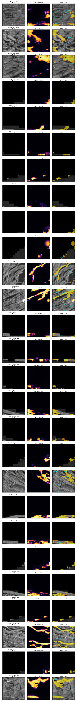
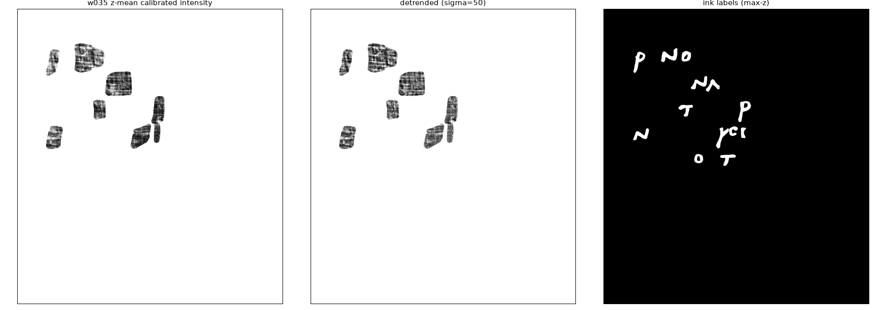
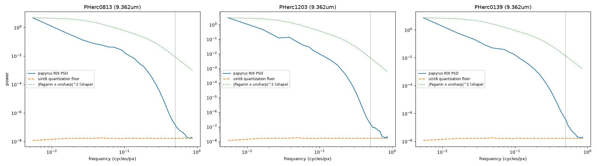
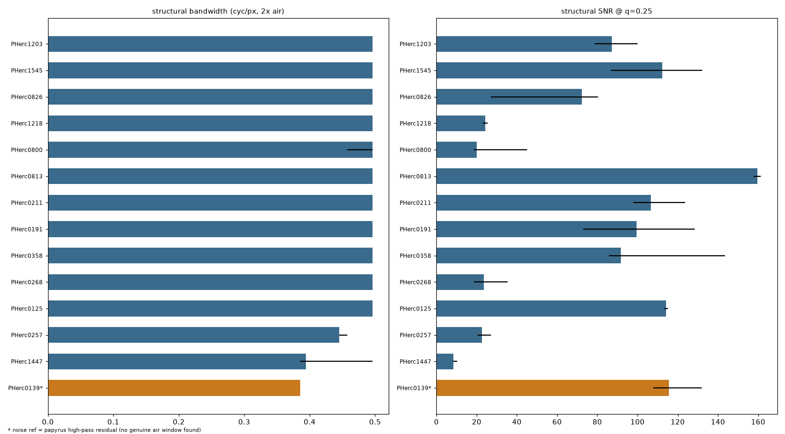

# 4. Methodology: adversarial QC as infrastructure

This section exists because most of what I found was my own mistakes. In 72 hours this process killed two results I was ready to submit, one screen hit I wanted to be real, and five claims inside this report — including one correction that turned out to be wrong itself. Every one was caught before it shipped. I would rather publish that ledger than a cleaner story, because the machinery that caught them is the part someone else can reuse.

The results in this report are mostly negatives, and the ones that are not negatives carry corrections. That is not an accident of this dataset; it is what happens when every result is attacked before it is believed. Over the project's first ~72 hours (2026-08-16 to 2026-08-18), the QC process described here caught **two would-be false-positive submissions** (S1a v1 and v2 — both would have claimed ink signal at GP resolution, both were artifacts of the background definition), **one would-be false-positive screen hit** (the single segment of 80 that cleared the corpus text-ruling threshold, refuted by its own null run at 25× the permutations — row 11 and §2.6), and **three methodological errors** (a kill-test statistic that structurally cancelled the signal it was testing for, an information-ceiling claim that an in-scan noise reference overturned, and a dual-energy screen looking for lead in the wrong tail of its own distribution). None reached a report or a submission form. Every kill in this section has a script, a JSON of numbers, and a named mundane explanation.

## 4.1 The pattern: reproduce first, then attack

Every result-producing run in Track D was followed by an adversarial audit — a separate pass (in practice, a separate agent session with no stake in the result) whose protocol was fixed:

1. **Reproduce the shipped numbers exactly before touching the interpretation.** All five audits achieved exact or near-exact reproduction (K1 AUCs to 2×10⁻⁴; K3 stage-1 stats exactly; S1a v1 stats exactly; S1a v2 per-tile AUCs to 4 decimals at every depth; the fleet screen's per-tile stats cross-machine to 5 decimals). This matters because it converts every subsequent refutation from "your pipeline disagrees with mine" into "your pipeline is right and measures the wrong thing."
2. **Attack the meaning with new discriminating experiments**, not re-runs: per-slice sweeps where a mean was reported, air-noise references where a floor was assumed, placebo masks where a contrast was claimed, physics cross-checks where a chemistry channel was named.
3. **Every claimed positive must beat a matched null** — matched in the property the confound lives in, not merely random. The project's null designs, in order of appearance: rotation/shift placebo masks through the identical pipeline (S1a), 40-shift location nulls plus trend-only and residual AUCs (S1a v2), size-and-strength-matched texture baselines for cross-seed reproduction (comb, where the naive baseline was 60% but the matched baseline was 97.3%), 28-window matched-radius/z ring nulls (K3 anomaly), and 256-px block-permutation nulls that preserve stroke texture while destroying long-range order (ink_9um battery).
4. **Autocorrelation is accounted for, not assumed away.** The instructive number: S1a v2's pooled AUC had a naive iid standard error of 0.0025; a 64-px block bootstrap put it at 0.030 — an effective-sample-size deflation of ×146, meaning the "n ≈ 40,000 pixels" experiment contained roughly 275 independent letter pixels, i.e. a handful of blobs. Pixel counts are not evidence counts.
5. **Every kill must name the mundane explanation that survives.** "Not significant" is not a verdict; "the background was 100% no-data pixels and the AUC measured papyrus vs segmentation failure" is.

The audits are shipped as first-class artifacts, with findings ranked BLOCKER / WARNING / OK:

| Audit document | Target | Blockers found | Outcome |
|---|---|---|---|
| `qc/k1_k2_review.md` | K1 intensity kill test + K2 spectral ceiling | 3 | K1 kill overturned (§4.4); K2 ceiling claim overturned, 2 claims confirmed (§4.5) |
| `qc/k3_stage1_review.md` | K3 dual-energy stage 1 | 4 | Pb-channel sign error caught pre-scale-up; stage 2 redesigned around it |
| `qc/s1a_verification.md` | S1a v1 letter-contrast (AUC 0.651 / 0.917) | fatal | REFUTED — background contained zero real predictions |
| `qc/s1a_v2_verification.md` | S1a v2 (AUC 0.614 / 0.902 vs 40-shift nulls) | fatal | REFUTED — same failure mode one level up; v3 requirements documented |
| `qc_live/round1_verdict.md` | PHerc1203 2.4 µm fleet screen (live, at ~45% completion) | — | Model refuted on-scroll, pipeline validated, fleet stopped (§4.2) |

Where possible, statistics were pre-registered: K1's kill rule (|AUC−0.5| < 0.02) was fixed before the data was fetched; the K1b depth-contrast statistic was frozen before touching the held-out segments (§4.4); the ink_9um tripwire thresholds (value > 195 DN ∧ area > 10⁴ px ∧ width > 30 px → mandatory human look) were set from the positive control before any PHerc1203 render was scored. Pre-registration did not prevent the K1 error — the registered statistic was itself the error — but it made the error *auditable*: the audit could state precisely what the rule had and had not tested.

## 4.2 The acceptance-gate battery, and the $4.46 fleet

The most consequential QC event of the project was operational, not statistical: a live audit that stopped a GPU fleet mid-run.

**The run.** 2026-08-16, ~22:00: six RTX 5090 pods went live screening the entire PHerc1203 2.403 µm band — the only GP-eligible data above the resolution wall — with `ink_3d_dino_guided` (checkpoint v3-78k-fullsup, trained on the near-identical-protocol PHerc.Paris.4 2.4 µm scan). Custom streaming screener (`runpod/screen_band.py`): non-overlapping 256³ tiles, mask-gated (~73% of tiles skipped), bounded S3 prefetch, 1.5–2.7 tiles/s per pod sustained. Projected job: ~169k tiles, ~5.5 h wall, $19–25 at a $3.49/hr launch burn ($4.19/hr by the time of the stop verdict). One bad host cost three pods early — caught by heartbeat, ~$0.40 lost, replacements CUDA-verified before provisioning. Session spend at launch: $0.62, against an $80 cap with an auto-terminate guard at $70 (`runpod/fleet_status.py`).

**The audit.** A QC agent ran a five-test battery against the partial output while the fleet was still burning: pipeline equivalence, an in-domain control, an in-domain distribution reference, firing morphology, and a single-tile input-adaptation probe. The scorecard with all numbers is **§3.7** (it is a result about the screen as much as a gate); the two that decided the stop were the in-domain reference (released Paris 4 prediction: 5 of 8 random blocks fire at exactly 0.000, versus **0 silent tiles in 3,346** on PHerc1203) and the adaptation probe (firing *doubled* under verified histogram matching — the input-side fix refuted rather than confirmed).

**The decision.** Verdict at ~45% completion: the remaining ~55% of the job would buy more samples from a distribution already shown to carry no rankable signal. Fleet stopped, all pods terminated. Total Track D cloud spend at that point: **$4.46 of the $80 cap**. The ~30k tiles of per-tile statistics already collected were secured and became the substrate for the salvage analysis (which revised the failure mechanism: 79% of fired voxels are thin sheet-conformal membranes on *intact* surfaces, not crack-followers — a concrete hard-negative recipe for any future fine-tune) — so the interrupted run was converted into a complete, quantified negative rather than a sunk cost.

**The gate.** The battery is now codified as an acceptance gate: any candidate ink model must pass tests 1–5 on **≤30 tiles** (27 probability pulls + a handful of full-resolution tiles; minutes of single-GPU time, ≈ $0–1) *before* any fleet spend. Honesty requires saying the gate was built during the failing run, not before it — the $4.46 story is the evidence that the gate works, and the codification is what prevents the next $20 from being spent learning the same lesson. The 9 µm lane has the corresponding second gate: the four-test text-signature battery of §2.5, §2.8, calibrated on human-verified letters, ~5 min/segment on CPU.

## 4.3 The corrections ledger

Every material correction of the project's own claims, in chronological order. "Record" points to the artifact where the correction is documented with full numbers.

| # | Claim as first stated | Correction | What caught it | Record |
|---|---|---|---|---|
| 1 | **K1:** "absolute intensity carries no linearly-recoverable ink signal at 9 µm — channel dead" (z-mean AUC 0.4956–0.5059, pre-registered kill rule met) | Kill valid only for the *depth-integrated* statistic. The ink signature is an antisymmetric depth profile (+8.6 DN at z=12, −6.3 DN at z=5–6) that the 17-slice z-mean integrates to +0.3 DN by construction; a linear depth-contrast reaches AUC 0.5715 on the same segment, mask, and labels | Adversarial re-audit: per-slice AUC sweep over all 28 slices + within-patch controls (7 supervision components, 0.553 ± 0.023 SE) | `qc/k1_k2_review.md` B1 |
| 2 | **K1 (corrected form):** "depth-resolved intensity is alive at 9 µm" — headline candidate | Real on the discovery segment only. Frozen statistic on held-out segments: w039 0.513, w040 0.501, w041 **0.466 (inverted)**; held-out mean 0.4934. Not a transferable detector; region-sign-instability is the finding (§4.4) | Pre-registered held-out validation, demanded by the same audit before any positive headline | `out/k1b_depth_validation.json` |
| 3 | **K2:** "the real information ceiling is the PSD cliff at ~15–19 µm half-period"; JSON shipped `smallest_recoverable_halfperiod_um` = 6.6–6.9 µm | Cliff is the papyrus autocorrelation × transfer-function shape, not a ceiling: against in-scan air-noise references, structure persists to q = 0.43–0.50 cyc/px (9.4–10.8 µm). The 6.6–6.9 µm numbers are physically impossible (below the 9.362 µm Nyquist half-period) — 3D-FFT corner artifacts, withdrawn (the keys survive in the shipped `out/k2_spectra.json` flagged as deprecated by the audit rather than removed; see `REPRODUCIBILITY.md` and `qc/k1_k2_review.md` B2) | Air-ROI noise-reference discriminator + Nyquist sanity check in the audit | `qc/k1_k2_review.md` B2/B3 |
| 4 | **K3:** "high-ratio tail = heavy-metal ink channel; dense candidates at ratio 1.705" | Pb's K-edge (88.0 keV) sits *between* the 74 and 110 keV beams → Pb ink is a **low**-ratio, co-bright anomaly (µ₇₄/µ₁₁₀ ≈ 0.67). The screen as designed was structurally blind to lead. And 1.705 → ~1.5–1.56 after rim erosion and selection-bias controls: a mid-Z (Ca/Fe) incrustation, not writing | Physics audit (NIST attenuation cross-check) before stage-2 scale-up — the sign error never produced a published claim | `qc/k3_stage1_review.md` B1/B2 |
| 5 | **S1a v1:** "letters brighter at GP resolution on PHerc1667 w032 — pooled AUC 0.651, best tile 0.917" | Background sets were 100.0% no-data pixels in all six tiles (the ink TIF's nonzero floor is ~28; the <20 background band selected only 0s), and tile selection *required* ≥30% no-data, forcing all tiles onto the segment's central tear. Corrected AUC 0.427, inside the placebo null. Evidence dead; thesis untested | Adversarial verification agent: exact reproduction, then background forensics + placebo masks | `qc/s1a_verification.md` |
| 6 | **S1a v2 (redesigned):** "controlled positive — pooled 0.614 surface-peaked, tile (9,9) 0.902 beats its 40-shift null (z = 5.8)" | Same failure one level up: 72% of the strongest tile's background was off-sheet air at raw0 ≈ 40–50 (sailed through the raw0 > 5 gate). On-sheet, excluding that tile: pooled 0.5035 (z = 0.34, 18/40 nulls above). The "unfakeable" surface-peaked profile is produced by 12–29% of location nulls; the dual-model confirmation mask was misregistered by (−36, +39) px | Second adversarial verification: depth-structure forensics, registration recovery, block-bootstrap ESS | `qc/s1a_v2_verification.md` |
| 7 | **K3 stage-1 QC's own claim:** "realistic Pb loadings are a >5σ single-voxel event" | Superseded: the linearization ignored the ratio's saturation toward the pure-Pb asymptote and uint8 window clipping. At the 4σ threshold used, *no physically realizable Pb configuration* can fire the screen; the published Herculaneum loadings (Tack 84, Brun 16 µg/cm²) produce ~1.0σ / ~0.3σ at realistic stroke geometry. The clean null validates the false-positive calibration; it does **not** exclude Tack/Brun-level metallic ink | Hostile-referee pass on the sensitivity bound (which also fixed 6 arithmetic/model errors in the bound itself) | `out/k3_sensitivity_bound.md` |
| 8 | **Fleet QC round 1:** "top-1% firing tiles are spatially anti-clustered — pure noise" | Coverage/small-n artifact of the partial data. Full 29,748-tile set: the top tail is strongly *clustered* (z = −12.6 against the spatial null). The operational stop-verdict was unchanged (clustered texture response is still not rankable signal), but the stated mechanism was wrong | Full-data replication during salvage | `salvage/scalar_report.md` |
| 9 | **ink_9um verdict:** "z-symmetry diagnostic — keep this" (cheap ink discriminator) | Valid at whole-map scale only. At tile scale, human-verified letter tiles trend toward *higher* symmetry than blank tiles (MW one-sided p = 0.97, i.e. the wrong direction); at component scale the reverse-map response is flat (74.7 / 77.5 / 77.3 DN for letters / candidates / texture) and every per-region fwd/rev ratio is a forward-strength readout | Calibration of the diagnostic against labels before first use as a localizer | `comb/COMB_VERDICT.md` flag 3 |
| 10 | **Salvage round 1:** "the 1203 false positives follow cracks" | Morphology census of 63 probability maps: 79% of fired voxels are thin (25–40 µm) sheet-conformal membranes on *intact* sheet surfaces; through-sheet crack ribbons ≈ 0.2%. Consequence inverted a plan: on-sheet gating can never rescue this output; fine-tuning needs sheet-surface hard negatives | Quantified morphology classification with coplanarity nulls (17.5° vs 50–60°) | `salvage/morph_report.md` |
| 11 | **Corpus screen, first pass:** "one segment of 80 clears the text-ruling threshold — PHerc1447 `z_dbg_gen_00166_inp_hr`, z = +5.94 at 7.26 mm" | Refuted. The screen's 16-permutation null underestimated its own sd by 2.2× (3.92 vs 8.43); under the *validated* battery protocol the same map scores **z = +0.54, empirical p = 0.18** (71/400 shuffles beat it). Familywise, E[# segments with z ≥ 5 among 80] = **1.07 against 1 observed** — the screen produced exactly the number of extreme hits its own noise predicts. The "7.26 mm period" is the lowest Fourier bin in the search band, with *negative* autocorrelation at 1P; 90.8% of the map's above-blank-p99 pixels lie in the model's own inference-patch halo, on an exact 64-px stride lattice | Pre-registered mandatory verification on any flag: 400-permutation nulls, a 10-segment familywise max-z null, mesh/tile-geometry forensics, and the full four-test battery | `verify_flag/FLAG_VERDICT.md` |
| 12 | **The corpus screen itself:** the per-segment ruling z published for all 69 scorable maps, and the ranking built on them | Superseded corpus-wide. The flag verification (row 11) refuted the *scorer*, not just the flag, so all four of its prescriptions were implemented and the entire corpus re-scored (`analyze_survey_corpus_v2.py`, `out/survey/PROTOCOL_V2.md`). Run v1's own scorer on the human-verified control and it returns **z = +13.74** — a 2.3× separation from its own worst false positive, where the hardened protocol gives 3.5×. Spearman ρ(v1 z, v2 z) = **+0.370** across the 69 segments both scored: four of v1's top five collapse, its #2 rises to the new top, and three segments v1 placed at or below zero rise into v2's top eight. **v1's ordering was substantially permutation noise.** The corrected screen is not weaker but stronger — 0 of 71 segments pass five pre-registered gates that the control passes 5 of 5 — and the correction is symmetric: the control's own z falls +25.6 → +16.3 once its null is drawn 200 times instead of 5 | Re-running the whole screen rather than caveating it, with the control put through the identical pipeline as a calibration check | `out/survey/PROTOCOL_V2.md`, `out/survey/corpus_analysis_v2.json` |
| 13 | **The index's own ROI rule (§1.1):** the 14-scroll scan-quality index is computed on windows selected as each scroll's highest 32-voxel-smoothed mean intensity subject to `fill > 0.98` | Those windows are preferentially **mineral incrustation, not laminated papyrus**. Re-sampling the identical frame uniformly at random scores **2.95× higher in 14 of 14 scrolls** (Mann-Whitney p = 5.4e-25); the intensity-picked cubes sit at 0.11-0.26 against a measured isotropic floor of **0.105**, i.e. barely above structureless. Picked ROIs run 24-68 DN brighter in every scroll, at median saturation 0.039 vs 0.0004. The tier split and campaign correlation survive (the bias is uniform and does not track the tier boundary, ratio 1.64-4.30 across both), but **no per-ROI value in §1.2 describes that scroll's typical material** | Building a second axis and running it on the shipped frame *and* an unbiased frame drawn from the same population — the comparison the original audit's W8 flagged as under-specified but never quantified | `out/k2c_separability/k2c_analysis.json`, §1.8.1 |
| 14 | **Our own PHerc0813 surfaces (§2.9):** "the five on-material patches show lamella modulation 0.036-0.074 against the control's 0.443" — read at the time as evidence the scroll's sheets are unresolvable | The material is fine; **the meshes are not**. All 8 patches sit at a median **68.1° to the local sheet normal, 0 of 8 within 30°**, against published GP meshes at **13.1°, 7 of 9 within 30°** (binomial p = 2.2e-05 vs a 60° random-orientation null) and Mann-Whitney ours-vs-published p = 0.00078. **Mechanism measured, cause probable.** In absolute coordinates our meshes have |n_z| = 0.876-1.000 (median 0.974, 8 of 8 above 0.7) against 0.004-0.307 (median 0.223, 0 of 9) for published meshes — complete separation. Our surfaces lie flat in the xy slice plane, slicing across the scroll's wraps; published ones run vertically through slices, following them. The likely cause is that our run dropped `normal_grid_path` (a v3 fallback) so the tracer defaulted to a z-axis orientation. Two earlier drafts of this row were wrong in opposite directions: one asserted the cause as fact by confusing `normal_grid_path` with the genuinely-optional `direction_fields`; the other declared it refuted by treating meshes with no recorded `vc_gsfs_params` as known to have run without a grid. Only 5 of 10 comparison meshes record their parameters, and among those it is 2 with a grid (13.1, 15.2 deg) against 2 without (11.3, 47.5 deg) -- suggestive, not decisive. Everything else matches: vertex spacing 187.9 um vs 172.8-194.6, flatness 0.045-0.056 vs 0.048-0.075. Tested twice. The 2026-08-21 attempt was **invalid** -- the script also switched `--volume` from the m7 surface-prediction zarr to the raw masked CT, moving two variables at once -- and is disclosed rather than silently discarded. The corrected run changed only `normal_grid_path` and **refuted the hypothesis**: |n_z| 0.974 (n=8) -> 0.986 (n=3), still all above 0.7 against published 0.223 and 0 of 9. The grid was genuinely in play (recorded in the new meshes' meta). A follow-up 16-run A/B (2026-08-25) also eliminated seeding: `mode: random_seed` and explicit seeds both come out flat (|n_z| medians 0.979 / 0.989, 16 of 16 above 0.7), and all 16 workers grew surfaces within 0.044% of the same area on an identical expansion schedule — growth on a bare zarr URL is data-blind. The surviving hypothesis is the missing volpkg context, which already provably drops the voxel size. A second lead was also closed off -- the `area_cm2: 0.0` in our metadata is a known consequence of running against a bare prediction zarr with no volpkg metadata (recomputing from vertices gives 13.70 cm2), and was documented in our own script header before we treated it as a signal. What survives: our patches grow to `generations x step_size` in-plane (~3,900 voxels) while published ones stop well short of their cap, so our growth is not being constrained by sheet structure at all | Measuring mesh normal against structure-tensor normal, then running the same code on published meshes as a positive control before believing the result | `out/k2c_separability/pherc0813_mesh_alignment.json`, `published_mesh_alignment.json`, §2.9.1 |
| 15 | **A null in this very analysis:** a phase-randomization test was written to show the separability statistic measures spatial structure rather than the power spectrum | **Invalid by construction and discarded.** By Parseval `J_ij = sum_q q_i q_j |F(q)|^2`, so the structure tensor depends only on the power spectrum and is phase-blind — the test could not have failed. Confirmed numerically on a single block (0.9968 observed vs 0.977-0.994 phase-randomized). Replaced by a **measured** isotropic floor (28 in-scan air windows, 0.105 median), and the claim narrowed to what is true: separability is the *angular* anisotropy of gradient power, where the §1 index is a *radial* property of the same spectrum | Checking the algebra of a null before trusting a result that passed it | `out/k2c_separability/isotropy_floor.json`, §1.8 |
| 16 | **The mesh-alignment measurement itself (§2.9.1):** the tifxyz validity mask was written as `~((x==0)&(y==0)&(z==0))` | **The sentinel for an invalid tifxyz vertex is −1, not 0**, so that mask matched nothing and −1 sentinels entered the gradient as real coordinates. The bias was badly asymmetric between the two populations being compared: our PHerc0813 patches are ~4 % invalid, the published GP meshes are **47–52 %** invalid. Recomputed with a sign-based mask and one-vertex erosion (a central difference needs valid neighbours): ours **67.3° → 68.1°**, published **14.6° → 13.1°**, Mann-Whitney p unchanged at 0.00078, binomial p unchanged at 2.2e-05. **The conclusion survived**, because an axial orientation tensor over tens of thousands of vertices is dominated by the bulk rather than by boundary artifacts — but it survived by luck of construction, not by design, and the comparison as first computed was not sound | Found while extending the same code to the full 80-segment corpus, where every segment returned "outside the scanned volume" — an impossible result that exposed the mask | `hunt/mesh_lamella_alignment.py`, §2.9.1 |

Rows 5 and 6 are the two would-be false-positive submissions; row 11 is a would-be false-positive screen hit, caught by a verification step that was committed to before the screen ran, and row 12 is that verification turning on the screen that produced it; rows 13 and 14 are the process turning on the report's own flagship index and on our own new geometry; row 15 is a null in the correcting analysis itself, discarded for being unfalsifiable, and row 16 is a masking bug inside the correction of row 14 — caught only because an unrelated extension of the same code produced an impossible answer; rows 1, 3, and 4 are the three methodological errors; rows 2 and 7–10 are corrections of corrections — the process applied to its own output, which is the property that makes it infrastructure rather than a one-off review. Note what the ledger implies about failure modes: six of the sixteen entries (1, 5, 6, 13, and partially 3, 9) are variants of a single trap — *a reference class that silently contains something other than what it names* (a mean that isn't a signal average, a background that isn't papyrus, a null that isn't matched). That trap is not exotic; it is the default state of segmentation-derived data, where "no prediction," "off surface," and "no data" all encode as low values.

Watching v1 die was fine; I had half expected it. Watching v2 die after I had rebuilt it specifically to survive was worse, and it is the moment I stopped trusting any result I had not attacked myself.

## 4.4 The K1/K1b micro-finding: a depth-antisymmetric intensity signature that does not travel

This is the one place where a correction produced a (small, carefully bounded) positive result, and the second correction bounded it further. It is reported as a **micro-finding about measurement, not a detector.**

**Discovery (w035, PHerc0139 — the segment where letters were found at native 9.362 µm; human ink labels, 334,024 ink / 737,091 background pixels).** The pre-registered K1 kill statistic — z-mean of the central 17 of 28 surface-volume slices — gave AUC 0.4956–0.5059 across all detrending scales and correctly fired the kill rule. The audit's per-slice sweep showed why that was the wrong death certificate: raw single-slice AUC rises to 0.553 at z = 12 and falls to 0.455–0.457 at z = 5–7 — a sign flip with depth. The ink-minus-background intensity profile is **+8.6 DN at z = 12 and −6.3 DN at z = 5–6** (~15 DN peak-to-trough), and over the registered z = 5..21 window it integrates to +0.3 DN. The z-mean did not measure "no signal"; it measured "this signal's depth profile integrates to ≈0."

A trivial linear feature built from that shape — mean(z10–14) − mean(z4–8) — gives pooled **AUC 0.5715** (0.5473 after σ=50 detrending), 3.6× the kill threshold, on the same data. Within-patch controls (the 7 connected supervision components, which rule out patch-level illumination confounds): 0.628, 0.562, 0.501, 0.637, 0.483, 0.559, 0.504 → 0.553 ± 0.023 (SE over patches). Independently, texture channels are alive: per-pixel z-std AUC 0.564 (smoothed), in-plane local-texture AUC 0.423 — ink is *smoother in-plane and more variable in depth* than papyrus. The physical reading: at 9 µm, ink does not shift a sheet's depth-integrated brightness; it reshapes the density profile along the surface normal — which is exactly what a 3D model can key on and what any z-averaged statistic deletes.

**Bounding (K1b).** The depth-contrast bands were chosen after seeing w035's sweep, so the audit required freezing the statistic and testing it once on the sibling native-9 µm labeled segments. Results (`out/k1b_depth_validation.json`):

| segment | ink px | bg px | depth-contrast AUC | z-std texture AUC |
|---|---|---|---|---|
| w035 (discovery) | 334,024 | 737,091 | **0.5717** | 0.514 |
| w039 (held out) | 182,426 | 393,793 | 0.5132 | 0.476 |
| w040 (held out) | 716,497 | 913,115 | 0.5012 | 0.548 |
| w041 (held out) | 229,883 | 325,746 | **0.4657 (inverted)** | 0.541 |
| w044 (held out) | — | — | not run (HuggingFace 429 rate limit; unresolved) | — |

Held-out mean 0.4934. The statistic reproduces on its discovery segment and does not transfer: one segment retains a weak same-sign effect, one is null, and one **inverts** — w041's |AUC−0.5| = 0.034 would have exceeded the original kill threshold in the opposite polarity. The texture channel is equally unstable (0.476–0.548 held out).

**What this is a finding about.** Not "intensity detects ink at 9 µm" (it does not, portably), and not "intensity is dead at 9 µm" (the original error). The defensible statement: *a real, physically sensible depth-resolved intensity signature exists at 9 µm but its strength and sign vary by segment* — 9 µm-class first-order statistics are region-unstable. Two consequences follow directly. First, per-region detectability measurement (the K2b index, and eventually per-region model evaluation) is the correct product shape; any statistic or model that assumes a uniform ink polarity will average a mixed-polarity signal toward zero. Second, this is a concrete mechanistic account of why learned 3D models succeed where linear channels fail — they can represent per-region depth profiles — and a caution for interpreting any single-segment model success as cross-segment evidence.

## 4.5 K2: the released 9 µm volumes are sampling-limited, not information-limited

K2 asked whether the released data format, or the scans themselves, impose an information ceiling below what ink detection needs. The first-pass answer shipped one confirmed claim and two errors; the corrected analysis is one of the report's few unambiguous positives about the data.

**What survived unchanged:** uint8 quantization is nowhere the binding constraint. Papyrus PSD sits 1–6 decades above the quantization floor across the entire per-axis band (minimum margins at q = 0.5: 9.5× / 10.0× / 23.3× for PHerc0813 / 1203 / 0139), and — the cleaner argument the audit substituted — the scans' own air noise (2.6–3.8 DN high-pass) is 9–13× the quantization σ of 0.289 DN, so rounding error is buried under scan noise before papyrus enters the picture.

**What was wrong, and the method that fixed it.** The first pass read the steep PSD falloff at 0.25–0.35 cyc/px as "the real information ceiling ~15–19 µm half-period." A falloff proves nothing — red spectra are what real objects look like, and the Paganin filter shapes exactly that band. The discriminating measurement is an **air-referenced bandwidth**: take an air ROI from the *same released volume* through the *same PSD pipeline* (gated on fill = 1, mean ≈ the window's air DN, minimal high-pass std — the gate matters: the first PHerc0139 "air" candidate was low-density structure at 13.2 DN hp-std and would have faked a pessimistic floor), then measure where papyrus structure falls to 2× the air power:

| scroll | papyrus/air @ q=0.25 | @ 0.35 | structure ≥ 2× air until | half-period |
|---|---|---|---|---|
| PHerc0813 | 30× | 6.8× | q = 0.433 | 10.8 µm |
| PHerc1203 | 29× | 8.1× | q = 0.444 | 10.5 µm |
| PHerc0139 | 39× | 13.5× | q = 0.499 | ≈9.4 µm (Nyquist) |

At the withdrawn "ceiling," papyrus carries 7–39× the actual measurement noise. **The released volumes run out of samples before they run out of information** — the constructive corollary being that finer sampling (rescans, or finer-grid releases) buys real signal, and that PHerc0139, the one scroll of the three that has been read, has both the cleanest scan (2.6 DN air noise) and structure above noise essentially to Nyquist.

**From measurement to index.** Two audit findings shaped the production version (K2b): single-ROI statistics carry up to ~25× site-to-site PSD spread at q = 0.5, so nothing single-ROI can rank scrolls; and only three statistics survived review as meaningful. The index therefore reports, per scroll, **median (IQR) over multiple independently-placed papyrus ROIs** (design ≥5; 2–5 passed the documented selection and air-validation gates per scroll) of: (a) air-referenced structural bandwidth, (b) structural SNR (papyrus/air power) at q = 0.25 (18.7 µm half-period — stroke-relevant scale), (c) DN headroom (in-mask p99.5–p0.5).

**The full 14-volume table, the two-tier split, the scan-campaign correlation, the PHerc0139 anchor and the clipping caveat are §1** — that section is the primary record for the index and supersedes any earlier statement of these numbers, including two this section's first draft got wrong: the degraded tier is **five** scrolls (PHerc1218, 0268, 0257, 0800, 1447 — SNR 8.5–24.4), not three; and the residual noise reference used for PHerc0139 is conservative **for bandwidth only** — for mid-band SNR it biases the value *high*, because real scan noise is colored (§1.2, note ᵃ). What belongs here is only the methodological lineage: K2 measured three volumes to establish the air-referencing method, and K2b industrialized it to fourteen.

**What the index does and does not claim.** It differentiates scrolls sharply and reproducibly (a 3.0× gap between tiers with no scroll inside it, §1.3). It does **not** yet predict readability: there is exactly one read anchor (PHerc0139), and its bandwidth median (0.386, conservative) is *below* several unread scrolls — so bandwidth alone is demonstrably not the readability axis, and we do not rank scrolls by "most likely to be readable." The defensible use is negative and prioritizational: scrolls at the bottom of the index are the ones where model failure cannot be attributed to the model, and the ones where a rescan buys the most.

## 4.6 What survives as infrastructure

The reusable artifacts, independent of any particular result in this report:

1. **The pre-fleet acceptance battery** (`qc_live/qc_*.py`, protocol in `qc_live/round1_verdict.md`): five tests, ≤30 tiles, refutes a non-transferring model for ≈$0–1 before a fleet is launched. Checkpoint-agnostic.
2. **The text-signature battery + tripwire** (§2.5, §2.8, `salvage/verdict_*.py`): four tests against texture-preserving nulls, calibrated on human-verified letters, ~5 min/segment; the standing tripwire replaces eyeballing with a pre-registered trigger for human review.
3. **The matched-null template for "the model found something beyond the labels"** (`comb/comb_skeptic_w035.py`, `comb_skeptic_w035b.py` + JSONs): size/strength-matched cross-seed baselines, texture-bootstrap alignment nulls, strength-matched forward/reverse decomposition. Any future beyond-labels claim on any scroll must clear these; on this data, they killed every support of an attractive-looking catalog.
4. **The ratio-anomaly base-rate map for the Paris 4 dual-energy pair** (`comb/comb_skeptic_k3.json`): 28 matched-radius/z windows establishing that whole-window median ratios span 1.17–1.52 (IQR 1.26–1.38) — the reference distribution against which any future "anomalous region" on this scan pair must be scored.
5. **The two S1a verification reports as method documents** (`qc/s1a_verification.md`, `qc/s1a_v2_verification.md`): a worked taxonomy of how letter-contrast claims fail on segmentation-derived data (no-data backgrounds, off-sheet air behind on-papyrus gates, geometry non-exchangeability, surface-fit depth artifacts, misregistered confirmation masks, ESS inflation), plus the v3 protocol a surviving claim would have to satisfy.
6. **The corpus survey harness** (`runpod/survey_segments.py`, `runpod/segment_catalog.json`, `analyze_survey_corpus_v2.py`): a resumable, JSONL-checkpointed render→infer→stats loop that screened every published GP segment for ≈$5.5 and survives pod loss, plus the laptop-side corpus screen over its saved maps. Its own under-powering was documented against it (§2.6) and then acted on: all four fixes are implemented in `analyze_survey_corpus_v2.py`, the whole corpus was re-scored, and the first pass's per-segment ranking did not survive (ledger row 12). The harness is listed here as reusable because of that round trip, not in spite of it — the screen, its own verification, and the re-score are all in the repo.
7. **The empty-volume QC gate** (`hunt/check_air.py`): sample a mesh's vertices against the masked volume at pyramid level 3 and reject any segment with a material fraction reading zero. Seconds per segment, no GPU. It flags 18 of the 65 published GP surfaces, and it caught the same defect immediately on our own newly grown PHerc0813 patches (§2.9).
8. **The flag-verification kit** (`verify_flag/vf_*.py`): given any screen hit, re-implement the screen's own statistic with switches for downsampling/detrending/erosion, run 400-permutation and familywise max-z nulls, fit the inference-tile lattice, and quantify the model's patch-boundary halo. Built for one flag; the failure modes it names (small-null sd underestimation, band-edge Fourier bins, tiling halos) are generic to every prediction-map screen.
9. **The audit protocol itself** (§4.1): reproduce-then-attack, matched nulls, named mundane explanations, BLOCKER/WARNING/OK verdicts. Nothing in it is specific to ink.

**What I am claiming from this section.** That the checking works, and that the ledger is the evidence. Sixteen corrections, five of them against results inside this report, every one caught before it shipped and every one published with the number that killed it. Three gates come out of that: a roughly $1 model-acceptance check that stopped a fleet run at $4.46, a five-minute text-signature battery with a tripwire fixed in advance, and a seconds-cheap mesh-alignment check born from catching my own surfaces pointing the wrong way. I am submitting this under honest evaluation and validation harnesses rather than as a discovery, because that is what it is. A negative result is only worth anything if you can show the machinery that would have caught you being wrong — this section is that machinery, and it caught me five times.
